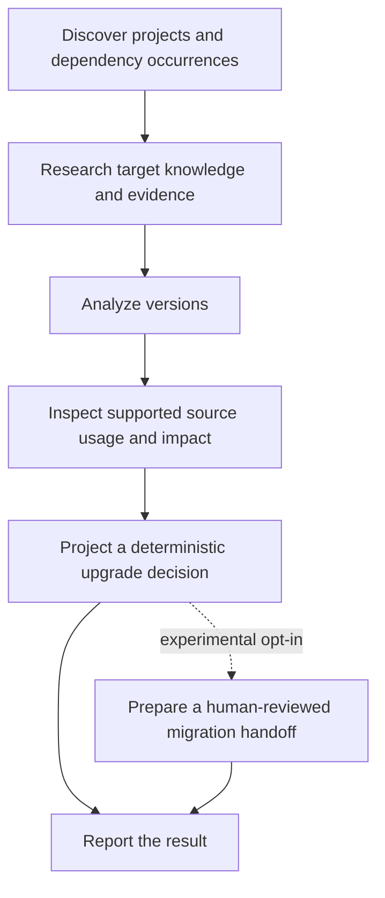

# DepVerdict

> **Public Technical Preview / Alpha**
>
> DepVerdict v0.6.0-alpha.1 is available as a Public Technical Preview.
> It is not production-stable and remains human-reviewed.

DepVerdict is a decision-first CLI for evidence-bounded dependency upgrade
analysis.

It discovers dependency occurrences in a repository, distinguishes declared,
installed, and target versions, checks how supported source files use those
dependencies, and projects a deterministic upgrade decision. When requested, it
also prepares an evidence-bounded migration handoff for human review.

DepVerdict helps answer:

- Should this dependency be upgraded?
- Why?
- What is the repository-specific risk?
- What evidence-bounded handoff is available for human review?

DepVerdict does not update dependencies, patch source code, authorize a Coding
Agent, or guarantee that a migration is safe.

## Why DepVerdict?

A registry reporting a newer version does not mean a team should upgrade. Release
notes do not know which dependency occurrence a repository uses, whether the
installed version differs from the declaration, or where affected APIs appear in
source.

Developers and Coding Agents can research these facts manually, but the context is
easy to lose and expensive to rebuild. DepVerdict produces versioned artifacts that
teams can inspect, discuss, and hand off:

- Registry latest is candidate discovery, not a recommendation.
- A positive upgrade recommendation requires a structured driver.
- Negative impact conclusions require complete analyzer coverage.
- AI-assisted output is bounded by selected official or publisher evidence.
- Humans choose targets, approve actions, and decide whether to migrate.

## Current capabilities

DepVerdict `0.6.0-alpha.1` includes:

1. Deterministic project and dependency discovery.
2. npm and PyPI knowledge and evidence research.
3. AI-assisted, schema-validated version analysis.
4. Repository usage and impact analysis.
5. Installed-version baseline resolution.
6. Coverage-aware impact semantics.
7. Deterministic Upgrade Decision projection.
8. Evidence-bounded Migration Checklist v2.
9. Decision-first product completion and CI exit semantics.
10. Offline research using fresh cached evidence with explicit limitations.

## Workflow overview



The primary command runs the stages in that order. Each stage consumes validated,
versioned artifacts from the preceding stages instead of inventing missing facts.

## Installation

### Requirements

- Node.js 20 or newer

Install the published preview explicitly:

```sh
npm install -g @thomasminh1995/depverdict@preview
depverdict analyze .
```

For a project-local development install:

```sh
npm install --save-dev @thomasminh1995/depverdict@preview
npx depverdict analyze .
```

npm currently also exposes this first published version through `latest`.
DepVerdict v0.6.0-alpha.1 remains an Alpha/Public Technical Preview; use
`@preview` explicitly. See the
[v0.6.0-alpha.1 release note](docs/releases/v0.6.0-alpha.1-depverdict-preview.md)
and [REL-02 verification](docs/reviews/rel-02-post-release-verification-feedback-readiness.md)
for the bounded distribution evidence.

Before testing a private repository, read the
[Technical Preview feedback guide](docs/community/technical-preview-feedback-guide.md)
for sanitization and public/private reporting routes.

## Provider configuration

DepVerdict uses a provider-neutral `AiRuntime` boundary. The CLI supports a generic
HTTP JSON adapter and an OpenAI-compatible adapter. OpenRouter can be configured as
an OpenAI-compatible endpoint, but it is not required by the product architecture.

For an OpenAI-compatible runtime, configure a full chat-completions endpoint and an
exact model identity:

```sh
export DEPVERDICT_AI_PROVIDER="openai-compatible"
export DEPVERDICT_AI_ENDPOINT="https://example-provider.invalid/v1/chat/completions"
export DEPVERDICT_AI_MODEL="provider/model-name"
export DEPVERDICT_AI_AUTHORIZATION="Bearer replace-me"
export DEPVERDICT_AI_TIMEOUT_MS="60000"
```

`DEPVERDICT_AI_AUTHORIZATION` is optional and must contain the complete
Authorization header value when the endpoint requires one. Never commit a real
credential. `DEPVERDICT_AI_DEBUG=1` enables sanitized runtime diagnostics; keep it
off unless those diagnostics are needed.

Changing a provider or model can change output quality. Structured-output validation,
deterministic decision policy, evidence allowlists, and human review still govern
what DepVerdict publishes. A provider/model is not qualified for Migration
Checklist execution merely because it is OpenAI-compatible; qualification is bound
to exact machine-readable runtime identity.

Applications can also inject an `AiRuntime` through the JavaScript API rather than
using environment configuration.

## Quick start

Run the complete decision-first workflow against the current repository:

```sh
depverdict analyze .
```

The console summary reports the overall completion state, each dependency decision,
installed and target versions, coverage, limitations, and the next step. Validated
JSON artifacts and the Markdown report are written under `.depverdict/`.

By default, research may discover `registryLatest` as a target candidate. That fact
does not express user intent and is not a recommendation driver. A newer registry
target alone does not become `PLAN_UPGRADE`; it normally produces `INVESTIGATE`.

Use `--stdout` to print only the machine-readable product-completion summary:

```sh
depverdict analyze . --stdout
```

Use `--progress auto|interactive|plain` to control progress rendering. `auto` selects
TTY-friendly or stable line-oriented output as appropriate. Heartbeats report real
elapsed time but never invent a percentage or ETA.

### Zero-secret Technical Preview sample

The source repository includes a small public-safe Node sample with a declared
dependency, a lockfile-installed baseline, and real source usage. Run deterministic
discovery without provider configuration:

```sh
depverdict discover examples/technical-preview-node --stdout
```

Run the bounded offline workflow:

```sh
depverdict analyze examples/technical-preview-node --offline --stdout
```

Without a fresh local knowledge cache, the honest expected result is
`INSUFFICIENT_DATA`: DepVerdict preserves the installed baseline but does not
invent a registry target, evidence, or recommendation. See the
[sample guide](examples/technical-preview-node/README.md) for the expected boundary
and the optional provider-configured next level. The sample is repository-only and
is not included in the npm tarball.

## Explicit target selection

A caller-owned target is repeatable and applies only to the matching dependency
occurrence:

```sh
depverdict analyze . \
  --target 'package=npm:framework-a,target=2.0.0'
```

Qualify a monorepo occurrence when package identity alone is not unique:

```sh
depverdict analyze . \
  --target 'package=npm:framework-a,target=2.0.0,project=node:apps/web,manifest=apps/web/package.json,type=dependency'
```

Scoped npm names are parsed as canonical package IDs; the `@` is not treated as a
version delimiter:

```sh
depverdict analyze . \
  --target 'package=npm:@scope/package,target=3.1.0'
```

Python targets use the Python version adapter:

```sh
depverdict analyze . \
  --target 'package=pypi:library-a,target=2.0.0'
```

If a selector matches multiple declarations, DepVerdict fails before provider
construction and prints exact candidate selectors. Copy one candidate, including its
stable occurrence identifier:

```sh
depverdict analyze . \
  --target 'package=pypi:library-a,target=2.0.0,project=python:.,manifest=requirements.txt,type=runtime,occurrence=sha256:<candidate-id>'
```

`<candidate-id>` is a placeholder; use the digest printed by your CLI run. A stale
occurrence ID, or an ID that conflicts with package/project/manifest/type fields,
fails closed before a provider call. The selected occurrence receives the explicit
target; other occurrences continue to use `registryLatest`.

## Deterministic Upgrade Decision

AI-assisted Version Analysis supplies bounded facts, but it does not own the final
decision state. DepVerdict applies a deterministic policy to installed and target
versions, evidence, repository impact, and coverage.

| Decision | User meaning |
| --- | --- |
| `KEEP_CURRENT` | The installed version needs no version change for the evaluated target. |
| `UPGRADE_NOW` | Reserved for a validated structured urgency driver. No current production urgency contract emits this state. |
| `PLAN_UPGRADE` | A structured caller-owned target and sufficient evidence support reviewed migration planning. |
| `INVESTIGATE` | A human must resolve target intent, evidence conflict, coverage, policy, or compatibility questions. |
| `INSUFFICIENT_EVIDENCE` | A required installed baseline, target, or target-scoped evidence is unavailable. |
| `NOT_ANALYZED` | Version analysis was skipped, failed, or unavailable. |

Important policy boundaries:

- Installed version equal to the target produces `KEEP_CURRENT`.
- A newer registry target without a structured recommendation driver produces
  `INVESTIGATE`.
- A validated caller-selected target can provide the `USER_SELECTED_TARGET` driver
  for `PLAN_UPGRADE`.
- AI prose and words such as “critical” cannot create `UPGRADE_NOW`.
- Unsupported ecosystems and incomparable versions fail closed to manual
  investigation.
- Partial, unavailable, or failed source coverage cannot support a negative
  repository-safety conclusion.

## Migration Checklist v2

**Experimental · Opt-in · Human-reviewed**

Enable the stage explicitly:

```sh
depverdict analyze . --experimental-migration-checklist
```

The handoff can include:

- decision, occurrence, and version facts;
- official evidence provenance and exact evidence-bounded excerpts;
- affected source areas backed by positive repository evidence;
- verification commands derived from supported project scripts;
- preconditions, limitations, review questions, next steps, and recovery
  availability.

The trust boundary is intentionally narrow:

- AI may select exact excerpts only from the occurrence's evidence allowlist.
- AI does not own the target, repository paths, commands, approval, recovery plan,
  rollback, or source patch.
- Migration actions are eligible only for `PLAN_UPGRADE` or `UPGRADE_NOW`.
- `KEEP_CURRENT`, `INVESTIGATE`, `INSUFFICIENT_EVIDENCE`, and `NOT_ANALYZED` do not
  produce migration actions.
- Suggested verification commands are displayed for review; DepVerdict does not
  execute them.
- Every published action requires human review.

By default the CLI looks for a persisted Migration Planning v2 qualification record
at:

```text
.depverdict/migration-planning-qualification.json
```

Select another repository-relative record with:

```sh
depverdict analyze . \
  --experimental-migration-checklist \
  --migration-qualification path/to/qualification.json
```

A matching real-runtime record must preserve the exact provider, model, adapter,
dataset, prompt, policy, schema, and deterministic presentation identity. Corrupted,
identity-mismatched, fake-runtime, or matching `NOT_QUALIFIED` records fail closed
before provider use. An invalid explicit path never falls back. A missing default
record may run only under the explicitly requested experimental path and is reported
as an experimental override, not as qualified.

The resulting artifact and any Coding Agent handoff are a review draft, not
authorization to edit source and not proof that a migration completed.

## Legacy compatibility during the preview

The `upgradelens` CLI, `.upgradelens/` artifact directory and `UPGRADELENS_*`
environment variables remain available during the `0.6.x` preview compatibility
window. New integrations should use `depverdict`, `.depverdict/` and
`DEPVERDICT_*`.

Legacy artifact input is a read fallback only; new implicit writes use
`.depverdict/`. DepVerdict never merges an artifact chain across the two roots.
Canonical environment values win conflicts, and legacy fallback emits bounded
warnings without printing values. See the
[UpgradeLens-to-DepVerdict migration guide](docs/migrations/upgradelens-to-depverdict.md).
Removal requires a separate compatibility decision and release note; this is not
an indefinite support promise.

## Product completion and exit codes

The top-level completion state distinguishes a trustworthy result from a partial or
failed pipeline:

| Completion | Meaning | Default exit | `--fail-on-incomplete` |
| --- | --- | ---: | ---: |
| `COMPLETED` | Evaluated targets need no additional review or version change. | 0 | 0 |
| `COMPLETED_WITH_REVIEW` | A valid result requires human review. | 0 | 2 |
| `INSUFFICIENT_DATA` | Required baseline, target, or evidence is missing. | 0 | 2 |
| `PARTIAL` | Some provider, output, runtime, or action-generation result failed and was retained. | 2 | 2 |
| `FAILED` | A fatal pipeline stage failed. | 1 | 1 |
| `CANCELLED` | The run was cancelled. | 130 | 130 |

`INVESTIGATE` is not a pipeline failure by default. Zero migration actions are not a
failure, and an all-`KEEP_CURRENT` result is successful. Retained provider/output
failures produce `PARTIAL` and exit 2.

Use strict mode when CI should fail on review-required or insufficient-data results:

```sh
depverdict analyze . --fail-on-incomplete
```

## Offline research

Use fresh repository-local cache entries and prevent registry/evidence research
requests:

```sh
depverdict analyze . --offline
```

Offline research can use repository dependency/source facts, fresh knowledge-cache
entries, and validated persisted artifacts. It does not fabricate evidence,
confidence, or a target when external evidence is unavailable. The result retains
limitations and may be `INSUFFICIENT_DATA` or `COMPLETED_WITH_REVIEW`, depending on
the canonical facts.

`--offline` is not equivalent to the online workflow: it prevents registry and
evidence-source requests, but Version Analysis can still require a configured or
injected AI runtime. Expired, missing, corrupted, or identity-mismatched cache
entries are not treated as fresh evidence.

## Generated artifacts

The unified `analyze` workflow writes these validated artifacts:

| Artifact | Purpose |
| --- | --- |
| `.depverdict/project-manifest.json` | Projects, dependency occurrences, declarations, and installed-version facts. |
| `.depverdict/knowledge-manifest.json` | Researched package, release, source, warning, and target-candidate metadata. |
| `.depverdict/knowledge-evidence-bundle.json` | Portable evidence records consumed by Version Analysis. |
| `.depverdict/version-analysis.json` | Per-occurrence version findings, evidence references, confidence, and limitations. |
| `.depverdict/usage-index.json` | Supported source usage plus project-level analyzer coverage. |
| `.depverdict/repository-impact.json` | Coverage-aware dependency and finding impact classifications. |
| `.depverdict/repository-impact-evidence.json` | Exact positive usage matches and impact evidence. |
| `.depverdict/upgrade-decision.json` | Deterministic per-occurrence decision records and reason codes. |
| `.depverdict/migration-checklist.json` | Optional experimental migration handoff, created only with the Checklist flag. |
| `.depverdict/repository-impact.md` | Human-readable assessment, decision summary, and next steps. |

The qualification record is an input to the optional Checklist stage; `analyze` does
not generate it.

Individual `discover`, `research`, and `analyze-version` commands are also available
for staged workflows. Run `depverdict --help` for their exact options.

## Supported scope and limitations

Support is layered. A detector existing for an ecosystem does not imply that every
downstream analyzer or resolver supports it.

| Layer | Current production scope |
| --- | --- |
| Project/dependency discovery | Node `package.json` projects and workspaces; Python `requirements.txt`. |
| Knowledge research | npm and PyPI registry adapters plus bounded evidence-source enrichment. |
| Installed-version baseline | npm `package-lock.json` v2/v3; limited v1 root-project compatibility. |
| Version comparison | Node SemVer and a bounded Python PEP 440 subset. |
| Source usage analysis | Node JavaScript/TypeScript files: `.cjs`, `.cts`, `.js`, `.jsx`, `.mjs`, `.mts`, `.ts`, `.tsx`. |
| Verification-command extraction | Safe `build`, `check`, `lint`, `test`, and `typecheck` scripts from Node `package.json`; commands are not executed. |

Important `0.6.0-alpha.1` limitations:

- pnpm and Yarn lockfiles do not currently resolve installed-version baselines.
- Python installed versions are not resolved from an environment or lockfile.
- npm lockfile v1 resolution is limited to root projects; workspace/member resolution
  is fail-closed.
- JavaScript/TypeScript is the only source usage analyzer. Python and experimental
  ecosystem detections therefore have unavailable source coverage.
- Partial or unavailable coverage cannot establish that an API is unused or an
  upgrade is safe.
- Unsupported ecosystems, declarations, or version formats require manual
  investigation.
- Recovery and rollback plans are not synthesized.
- Verification commands are suggested from project metadata but never executed.
- DepVerdict does not modify manifests, install packages, patch code, or run a
  migration.
- Migration Checklist v2 remains experimental and opt-in.

Early discovery exists for `pyproject.toml`, Maven/Gradle, .NET, Go, Rust, Ruby, PHP,
and Business Central AL projects. Detection does not imply supported dependency
parsing, installed baselines, source analysis, upgrade decisions, or migration
handoffs for those ecosystems.

## Human in the loop

DepVerdict creates an assessment and a bounded handoff. The developer or team must:

1. Review target identity, evidence, risk, coverage, and affected areas.
2. Resolve investigation questions and choose or approve the target.
3. Approve each migration action and decide whether work should proceed.
4. Re-open target files before patching to detect snapshot drift.
5. Run and assess verification and define recovery or rollback steps.

A Coding Agent may consume the handoff for bounded execution planning, but it must
inspect the current source before proposing a patch. No artifact is authorization to
change code, proof of migration completion, or a safety certification.

## JavaScript API

The package exposes its public API from the root entry point:

```js
import { discoverProject } from '@thomasminh1995/depverdict';

const manifest = await discoverProject('.');
```

The CLI is the primary product workflow. Programmatic callers are responsible for
providing the same runtime configuration and preserving artifact/qualification trust
boundaries.

## Development and validation

```sh
npm ci
npm test
npm run check
npm run check:package
```

Design and contract references:

- [Current architecture overview](docs/architecture-overview.md)
- [Project Manifest](docs/MVP-01.md)
- [Knowledge Manifest](docs/MVP-02-Knowledge-Manifest.md)
- [Version Analysis architecture](docs/version-analysis-architecture.md)
- [Repository impact analysis](docs/IA-02-Repository-Impact-Analysis.md)
- [Deterministic Upgrade Decision](docs/mp-r03-deterministic-upgrade-decision-architecture.md)
- [Migration Checklist v2 contract](docs/mvp-05-migration-checklist-contract.md)
- [Product completion and decision-first CLI](docs/mp-r05-product-completion-and-decision-first-cli-architecture.md)
- [CLI progress contract](docs/cli-progress.md)
- [UpgradeLens-to-DepVerdict migration guide](docs/migrations/upgradelens-to-depverdict.md)

## Roadmap

Completed product layers:

- ✓ MVP-01 — deterministic project discovery
- ✓ MVP-02 — knowledge and evidence research
- ✓ MVP-03 — AI-assisted version analysis
- ✓ MVP-04 — repository usage and impact analysis
- ✓ MVP-05 — evidence-bounded migration planning

Potential follow-ups, not current supported features:

- broader installed-version resolvers and source analyzers;
- structured security, end-of-support, and organization-policy drivers;
- recovery and rollback evidence;
- reviewed CI verification execution;
- broader model/provider evaluation and offline knowledge support;
- IDE or MCP integrations.

## Community

- [Contributing](CONTRIBUTING.md)
- [Security](SECURITY.md)
- [Support](SUPPORT.md)
- [Code of Conduct](CODE_OF_CONDUCT.md)
- [Technical Preview feedback guide](docs/community/technical-preview-feedback-guide.md)

### Technical Preview feedback

When reporting feedback, tell us whether decisions are understandable and
actionable; whether `INVESTIGATE` is too frequent or too rare; whether installed
baselines and ambiguity selectors work in real npm workspaces; whether coverage
limitations prevent false confidence; whether the migration handoff reduces
re-research; whether completion states and exit codes work in CI; and which
artifacts help code review or team planning. Use the feature or bug form described
in [Support](SUPPORT.md), and never include credentials, private source, or raw
provider payloads.

## License

[MIT](LICENSE)
