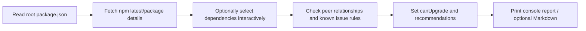

```mermaid
flowchart LR
    A["Discover project and exact dependency occurrence"] --> B["Research versions and bounded evidence"]
    B --> C["Resolve installed baseline and analyze target"]
    C --> D["Discover source usage and coverage"]
    D --> E["Assess impact and link evidence"]
    E --> F["Apply deterministic driver and decision policy"]
    F --> G["Generate reviewed migration handoff (optional)"]
    G --> H["Persist artifacts and report completion"]
```

# UpgradeLens vs UpgradeDepDetective source comparison

Assessment date: 2026-07-19  
Comparison basis: immutable committed snapshots; external source was treated as untrusted and was read but never executed.

Evidence labels used below:

- **[S]** direct source or package metadata at the stated commit.
- **[T]** test or evaluation evidence.
- **[D]** README or other documentation claim.
- **[M]** GitHub, npm, Git, release, or CI metadata.
- **[I]** inference drawn from the cited evidence.

## 1. Executive verdict

**Relationship verdict: `UPGRADELENS_DIFFERENTIATED_WITH_OVERLAP`**

**Public-preview impact: `UPDATE_POSITIONING_BEFORE_PUBLIC_PREVIEW`**

The repositories address the same broad problem—helping JavaScript projects evaluate dependency upgrades—but implement materially different products. UpgradeDepDetective is a compact npm CLI that compares declared dependency versions with registry latest versions, checks selected peer-dependency relationships and emits console/Markdown output. UpgradeLens is a repository-aware, evidence-bounded analysis pipeline whose central contract separates version availability from an upgrade recommendation, identifies exact dependency occurrences, represents incomplete evidence explicitly, persists reusable artifacts and produces a reviewed migration handoff. **[S][I]** ([UpgradeLens pipeline](https://github.com/thomasMinh1995/UpgradeLens/blob/c91fbb0032b0e2f6209cb4a14aeeb68d9cf0c28d/src/orchestration/pipeline.js), [decision policy](https://github.com/thomasMinh1995/UpgradeLens/blob/c91fbb0032b0e2f6209cb4a14aeeb68d9cf0c28d/src/upgrade-decision/upgrade-decision.js), [UpgradeDepDetective entry point](https://github.com/zjp123/UpgradeDepDetective-/blob/d6e5efcb852ba3848fb14dbdcbd7058b17bb6cde/src/index.js), [compatibility logic](https://github.com/zjp123/UpgradeDepDetective-/blob/d6e5efcb852ba3848fb14dbdcbd7058b17bb6cde/src/compatibility.js))

No meaningful non-standard source-text match was found. The material overlap is instead in product identity: the external repository used the displayed name **UpgradeLens**, package name `upgrade-lens`, and CLI `upgrade-lens` before the local project existed; `upgrade-lens@1.0.2` is already published on npm. **[M][S]** This is not evidence of copied implementation, but it creates avoidable brand, discoverability and distribution confusion. Public technical evaluation can proceed, but broader promotion or npm publication should follow an explicit naming and positioning decision.

## 2. Snapshot identities and dates

| Attribute | UpgradeLens | UpgradeDepDetective |
| --- | --- | --- |
| Repository | `thomasMinh1995/UpgradeLens` | `zjp123/UpgradeDepDetective-` (trailing `-` is part of the identity) |
| Visibility/access | Public, accessible, unarchived **[M]** | Public, accessible, unarchived **[M]** |
| Default branch | `main` **[M]** | `main` **[M]** |
| Exact baseline SHA | [`c91fbb0032b0e2f6209cb4a14aeeb68d9cf0c28d`](https://github.com/thomasMinh1995/UpgradeLens/commit/c91fbb0032b0e2f6209cb4a14aeeb68d9cf0c28d); local and remote matched **[M]** | [`d6e5efcb852ba3848fb14dbdcbd7058b17bb6cde`](https://github.com/zjp123/UpgradeDepDetective-/commit/d6e5efcb852ba3848fb14dbdcbd7058b17bb6cde) **[M]** |
| Repository created | 2026-07-13 15:04:42 UTC **[M]** | 2025-04-28 08:02:39 UTC **[M]** |
| Baseline commit date | 2026-07-19 13:50:13 +07:00 **[M]** | 2025-06-18 08:00:04 UTC **[M]** |
| Package | `upgradelens@0.5.0`, Node `>=20`, ESM **[S]** | `upgrade-lens@1.0.2`, Node `>=14.16`, ESM **[S]** |
| Primary language/runtime | JavaScript / Node.js **[S][M]** | JavaScript / Node.js **[S][M]** |
| Tags/releases | Tags `v0.1.1`–`v0.5.0`; GitHub release `v0.5.0` published 2026-07-19. Baseline SHA is after the tag. **[M]** | No public tags or GitHub releases at assessment time. **[M]** |
| Public CI | Latest baseline push run [29677083963](https://github.com/thomasMinh1995/UpgradeLens/actions/runs/29677083963) completed successfully on 2026-07-19. **[M]** | No workflow under `.github/workflows` at the baseline. **[S]** |
| Registry state | Unscoped `upgradelens` and planned/scoped `@thomasminh1995/upgradelens` returned npm 404 on 2026-07-19. **[M]** | `upgrade-lens` is published; versions `1.0.0`, `1.0.1`, `1.0.2`, latest `1.0.2`. **[M]** |
| Baseline size | 457 tracked files: 124 under `src`, 90 test files, 22 schemas, 19 evaluation files, 178 docs, 4 examples. **[M]** | 12 tracked files, including four source modules and no test files or CI workflow. **[M]** |

Uncommitted and untracked local files were excluded. The UpgradeLens baseline was reconstructed from the exact committed tree, not the working tree. The external baseline was inspected in an isolated temporary clone at its exact SHA with hooks disabled, without submodules, installation, build, tests, binaries, or lifecycle scripts.

## 3. License/provenance assessment

Both baselines contain an MIT license:

- UpgradeLens: MIT, copyright 2026 `thomasMinh1995`. **[S]** ([LICENSE](https://github.com/thomasMinh1995/UpgradeLens/blob/c91fbb0032b0e2f6209cb4a14aeeb68d9cf0c28d/LICENSE))
- UpgradeDepDetective: MIT, copyright 2023 `UpgradeLens`; the license file entered its history in April 2025. **[S][M]** ([LICENSE](https://github.com/zjp123/UpgradeDepDetective-/blob/d6e5efcb852ba3848fb14dbdcbd7058b17bb6cde/LICENSE))

**Reuse classification: `LICENSE_REQUIRES_ATTRIBUTION_OR_DISCLOSURE`.**

Reading public source and independently implementing a product concept is different from copying protected source expression. MIT generally permits use, modification and distribution, but copies or substantial portions must retain the copyright and permission notice. Therefore:

- Reference-only analysis and clean-room implementation of high-level ideas are compatible.
- Copying source, prompts, prose, tests or distinctive structure would require preserving the external notice and recording provenance.
- The external notice names the product rather than a clearly identified person or entity and predates the repository by two years. That does not invalidate the assessment, but it is an additional reason to avoid code reuse unless ownership/provenance is clarified.
- A public repository without a license would remain copyrighted by default; that is not the case for either assessed baseline.

No external code reuse is recommended or performed by this review. This is a technical provenance assessment, not legal advice.

## 4. Product summaries

### UpgradeLens

- **Users/problem:** maintainers and coding agents deciding whether and how to upgrade a dependency in a real repository. **[D][S]**
- **Interface:** multi-command CLI plus programmatic exports; primary flow is `analyze`. **[S]** ([CLI](https://github.com/thomasMinh1995/UpgradeLens/blob/c91fbb0032b0e2f6209cb4a14aeeb68d9cf0c28d/src/cli.js), [package metadata](https://github.com/thomasMinh1995/UpgradeLens/blob/c91fbb0032b0e2f6209cb4a14aeeb68d9cf0c28d/package.json))
- **Input:** repository, dependency/occurrence selection, optional target and evidence/provider configuration. **[S]**
- **Output:** versioned JSON artifacts, decision states, Markdown report and an experimental evidence-bounded migration handoff. **[S][D]**
- **Review/autonomy boundary:** performs analysis and suggestions but does not modify application source; non-trivial decisions retain human-review requirements. **[S]**
- **Ecosystems:** implemented discovery for Node package/workspace projects and Python requirements; deeper installed-baseline and usage support is strongest for npm/JavaScript/TypeScript. **[S]**
- **Offline/provider behavior:** deterministic discovery and parts of analysis work without a model; offline prevents registry/evidence calls but does not make every provider-dependent path available. **[S]**
- **Distribution/maturity:** GitHub release and package smoke are available; npm publication is absent. Positioning is technical preview. **[M][D]**

### UpgradeDepDetective

- **Users/problem:** JavaScript maintainers checking available dependency updates and selected inter-package compatibility. **[D][S]**
- **Interface:** single Commander CLI with optional interactive selection, deep flag and Markdown output. **[S]** ([entry point](https://github.com/zjp123/UpgradeDepDetective-/blob/d6e5efcb852ba3848fb14dbdcbd7058b17bb6cde/src/index.js))
- **Input:** a directory containing a root `package.json`; runtime dependencies are the effective registry-analysis set. **[S]**
- **Output:** ephemeral console report and optional Markdown file. **[S]**
- **Review/autonomy boundary:** lets a user select dependencies interactively; it neither changes source nor provides a structured review/approval state. **[S]**
- **Ecosystems:** root npm package metadata only. The README's frontend framing does not add analyzers for other ecosystems. **[D][S]**
- **Offline/provider behavior:** no AI provider; npm registry availability is required for fresh package/version details. **[S]**
- **Distribution/maturity:** published as `upgrade-lens@1.0.2`; compact codebase, but no source tests, public CI, tags or GitHub releases at the baseline. **[M][S]**

### Public-surface inventory

| Surface | UpgradeLens | UpgradeDepDetective |
| --- | --- | --- |
| Commands/flags | Commands: `analyze`, `discover`, `research`, `analyze-version`, `eval`, `scorecard`, `benchmark`, `conformance`, `governance`. Primary flags include `--target`, `--offline`, `--stdout`, `--progress` and experimental migration-checklist opt-in. **[S][D]** | One command with `--path`, `--deep`, `--interactive` and `--output`; `--deep` has no behavioral use in the analyzer at the baseline. **[S]** |
| Configuration | CLI options plus `UPGRADELENS_AI_PROVIDER`, `UPGRADELENS_AI_ENDPOINT`, `UPGRADELENS_AI_MODEL`, optional authorization, timeout and sanitized-debug controls; callers can inject an `AiRuntime`. **[S][D]** | CLI flags only; no environment/provider configuration was found. **[S]** |
| Programmatic API | ESM export surface from `src/index.js`; committed package-smoke verification checked 438 public exports. **[S][T]** | `src/index.js` is both bin and package main; the package does not define a separately governed library export map. **[S]** |
| Schemas/artifacts | 22 tracked schemas and ten documented/versioned primary workflow artifacts at this baseline. **[S][D]** | No tracked schema; in-memory objects plus console/optional Markdown. **[S]** |
| Reports | Decision-first console/product-completion summary, validated JSON under `.upgradelens/`, Markdown report and optional migration handoff. **[S]** | Console report and optional Markdown containing a locale-formatted generation time. **[S]** |
| Exit semantics | Product completion maps complete/review, partial, failure and cancellation to documented exit behavior including `0`, `2`, `1`, `130`; strict mode can strengthen CI handling. **[S][T]** | Normal completion is implicit `0`; top-level fatal catch exits `1`; per-package/report errors do not consistently change the overall exit. **[S]** |
| Package identity | `upgradelens@0.5.0`, bin `upgradelens`, explicit exports, MIT, Node `>=20`; not published on npm at assessment time. **[S][M]** | `upgrade-lens@1.0.2`, bin `upgrade-lens`, main `src/index.js`, MIT, Node `>=14.16`; published on npm. **[S][M]** |

## 5. Architecture comparison

| Concern | UpgradeLens | UpgradeDepDetective |
| --- | --- | --- |
| Entry points | `src/cli.js`, public exports from `src/index.js`; commands include `analyze`, `discover`, `research`, `analyze-version`, `eval`, `scorecard`, `benchmark`, `conformance`, `governance`. **[S]** | `src/index.js`; one CLI flow with path/deep/interactive/output options. **[S]** |
| Orchestration | Eight core stages: project discovery → knowledge research → version analysis → usage discovery → impact analysis → impact evidence → upgrade decision → report; migration checklist can be inserted before reporting. **[S]** | Linear flow: analyze root package → optional interactive filtering → compatibility analysis → report. **[S]** |
| Contracts/persistence | Versioned artifact schemas and persisted JSON/Markdown outputs; 22 schema files at baseline. **[S]** | In-memory JavaScript objects; optional Markdown report, no schema contract. **[S]** |
| Parsing/baseline | Package/workspace discovery plus npm lockfile-aware installed-version resolution with fail-closed ambiguity handling; pnpm/Yarn remain unsupported. **[S]** | Reads root `package.json`; derives “current” by stripping non-digits from a declared range. Lockfile is not consulted. **[S]** ([analyzer](https://github.com/zjp123/UpgradeDepDetective-/blob/d6e5efcb852ba3848fb14dbdcbd7058b17bb6cde/src/analyzer.js)) |
| Research | Registry and evidence/document research with provenance. **[S]** | Sequential npm packument calls; no changelog/release-note/document evidence model. **[S]** |
| Source analysis | JavaScript/TypeScript usage discovery and explicit coverage states/reasons. **[S]** | No application-source analysis. **[S]** |
| Decision | Deterministic policy with `KEEP_CURRENT`, `UPGRADE_NOW`, `PLAN_UPGRADE`, `INVESTIGATE`, `INSUFFICIENT_EVIDENCE`, `NOT_ANALYZED`; availability alone is not a driver. **[S]** | Boolean `canUpgrade`, selected peer checks and two hard-coded known-issue rules; registry latest is the candidate. **[S]** |
| Migration | Evidence-bounded, extractive action/checklist generation with review and qualification gates. **[S][T]** | No migration action generation. **[S]** |
| AI boundary | Provider-neutral runtime and OpenAI-compatible HTTP provider; structured schemas and deterministic post-validation. **[S]** | No production AI path. `gen.md` is a scaffold/design document, not an invoked prompt. **[S]** |
| Validation | Evidence allowlists, occurrence identity, coverage/reason states, provider failure types, qualification suites. **[S][T]** | Ad hoc validation; one compatibility path defaults to compatible when details are unavailable. **[S]** |
| Tests/evaluation | 90 test files, evaluation datasets/scorecards/qualification logic; hosted CI currently green. **[T][M]** | Jest script and `prepublishOnly` exist, but no tracked tests and no hosted workflow. **[S]** |
| Release tooling | Read-only CI on Node 20/22/24 and package smoke; versioned GitHub releases. **[S][M]** | Published npm package and publishing guide; no CI workflow or repository release tags. **[S][M]** |

UpgradeLens exposes a much larger public surface (438 exports were checked by its committed package-smoke qualification), which enables composition but increases API-governance cost. UpgradeDepDetective's four-module architecture is easier to understand, but its smaller surface also omits repository identity, evidence and decision safeguards. **[T][S][I]**

## 6. Feature matrix

| Capability | UpgradeLens | UpgradeDepDetective | Evidence | Practical difference | Winner/Trade-off |
| --- | --- | --- | --- | --- | --- |
| 1. Project/ecosystem discovery | `IMPLEMENTED` | `PARTIALLY_IMPLEMENTED` | UL discovery modules; UDD root `package.json` reader **[S]** | UL discovers projects/workspaces and records unsupported scope; UDD assumes one npm root. | UL scope truthfulness |
| 2. Dependency declaration parsing | `IMPLEMENTED` | `PARTIALLY_IMPLEMENTED` | UL parsers; UDD analyzer **[S]** | UDD records dependency groups but registry analysis effectively iterates runtime dependencies only. | UL |
| 3. Installed-version resolution | `PARTIALLY_IMPLEMENTED` | `NOT_FOUND` | UL `installed-version-baseline.js`; UDD declared-range cleanup **[S]** | UL resolves supported npm lock formats and fails closed; UDD does not establish an installed baseline. | UL |
| 4. Lockfile/workspace support | `PARTIALLY_IMPLEMENTED` | `NOT_FOUND` | UL npm lock/workspace source and tests; UDD source **[S][T]** | UL supports npm lock v2/v3 and limited v1; not pnpm/Yarn. | UL |
| 5. Latest/target discovery | `IMPLEMENTED` | `IMPLEMENTED` | Registry modules in both **[S]** | UDD chooses latest; UL distinguishes candidate availability, explicit target and recommendation. | Trade-off: UDD simpler, UL safer |
| 6. Release notes/changelog/docs research | `IMPLEMENTED` | `NOT_FOUND` | UL knowledge/evidence stages; UDD modules **[S]** | UL can ground risk in documents; UDD uses package metadata and fixed rules. | UL |
| 7. Evidence provenance | `IMPLEMENTED` | `NOT_FOUND` | UL evidence contracts/schemas **[S]** | UL tracks evidence references; UDD has no provenance artifact. | UL |
| 8. AI-assisted analysis | `IMPLEMENTED` | `NOT_FOUND` | UL AI version/migration paths; UDD has no invoked AI **[S]** | UL can synthesize bounded evidence but adds provider uncertainty; UDD is deterministic and provider-free. | Trade-off |
| 9. Provider/model abstraction | `IMPLEMENTED` | `NOT_FOUND` | UL `ai-runtime.js`, OpenAI-compatible provider **[S]** | UL avoids a single named-provider contract; cross-model quality is not yet fully proven. | UL potential |
| 10. Offline mode | `PARTIALLY_IMPLEMENTED` | `NOT_FOUND` | UL offline branches; UDD registry calls **[S]** | UL preserves some local analysis, not the complete provider/research workflow. | UL |
| 11. Source usage detection | `PARTIALLY_IMPLEMENTED` | `NOT_FOUND` | UL usage analyzer; UDD does not scan source **[S]** | UL can relate dependency use to repository areas, currently strongest for JS/TS. | UL |
| 12. Coverage awareness | `IMPLEMENTED` | `NOT_FOUND` | UL coverage states/reason codes **[S][T]** | UL distinguishes complete/partial/unavailable/failed rather than implying unseen source is safe. | UL |
| 13. Breaking-change matching | `PARTIALLY_IMPLEMENTED` | `PARTIALLY_IMPLEMENTED` | UL evidence/usage matching; UDD peers plus two known issues **[S]** | UL is evidence/usage-oriented; UDD offers narrow deterministic peer checks. Neither proves general semantic compatibility. | Different strengths |
| 14. Deterministic upgrade decision | `IMPLEMENTED` | `PARTIALLY_IMPLEMENTED` | UL decision policy; UDD `canUpgrade` **[S]** | UL has replayable states/reasons; UDD has a boolean heuristic. | UL |
| 15. Recommendation-driver policy | `IMPLEMENTED` | `PARTIALLY_IMPLEMENTED` | UL driver policy; UDD latest-based flow **[S]** | UL requires a valid driver; UDD can turn latest availability into upgradeability. | UL |
| 16. Duplicate occurrence identity | `IMPLEMENTED` | `NOT_FOUND` | UL target selector/hash/tests; UDD flat dependency map **[S][T]** | UL rejects ambiguous or stale occurrence selection before provider work. | UL |
| 17. Migration action/handoff | `IMPLEMENTED` | `NOT_FOUND` | UL migration v2 contracts/qualification **[S][T]** | UL emits reviewable evidence-bounded actions; UDD stops at compatibility/reporting. | UL, experimental value |
| 18. Human-in-the-loop review | `IMPLEMENTED` | `PARTIALLY_IMPLEMENTED` | UL review flags/states; UDD interactive filter **[S]** | UDD selection UX is useful, but lacks a decision approval boundary. | Different strengths |
| 19. Verification commands | `IMPLEMENTED` | `NOT_FOUND` | UL migration artifacts **[S][T]** | UL may propose evidence-linked verification; it does not execute it. | UL |
| 20. Recovery/rollback | `PARTIALLY_IMPLEMENTED` | `NOT_FOUND` | UL completion/failure semantics; no full migration rollback **[S]** | UL represents operational recovery but does not provide automatic code rollback. | UL limited |
| 21. Source modification/automation | `NOT_FOUND` | `NOT_FOUND` | Both source trees **[S]** | Both avoid autonomous dependency/source changes. | Parity; safe boundary |
| 22. CI integration and exit codes | `IMPLEMENTED` | `PARTIALLY_IMPLEMENTED` | UL workflows/completion mapping; UDD fatal catch **[S][M]** | UL maps completion to 0/2/1/130 and runs hosted matrices; UDD lacks CI and may complete after partial registry/report failures. | UL |
| 23. Reports/artifacts | `IMPLEMENTED` | `IMPLEMENTED` | Both reporters **[S]** | UL persists versioned reusable artifacts; UDD console/Markdown includes local-time output and no schema. | Trade-off: UDD simpler, UL reusable |
| 24. Security/privacy boundaries | `IMPLEMENTED` | `NOT_FOUND` | UL provider/evidence/security contracts; UDD source/docs **[S][D]** | UL makes network/provider and evidence boundaries explicit. | UL |
| 25. Community contribution readiness | `IMPLEMENTED` | `DOCUMENTED_ONLY` | UL templates/security/support/CI; UDD README contribution sentence **[S][D]** | UL has public scaffolding; UDD has no issue templates or CI gate. | UL |
| 26. Testing/evaluation maturity | `IMPLEMENTED` | `DOCUMENTED_ONLY` | UL tests/evals/CI; UDD Jest script without tests **[T][S]** | UL checks policy and provider behavior; UDD package hook can pass with no tests. | UL |
| 27. Installation/package distribution | `PARTIALLY_IMPLEMENTED` | `IMPLEMENTED` | GitHub release/npm metadata **[M]** | UDD already has one-command npm distribution; UL package smoke passes but no npm package exists. | UDD |
| 28. Developer/Coding Agent handoff | `IMPLEMENTED` | `NOT_FOUND` | UL persisted artifact/report contracts **[S][T]** | UL outputs can reduce repeat research and preserve review boundaries; realized community value still needs feedback. | UL potential |

This matrix is not a feature-count score. UpgradeDepDetective wins on immediate installation, compactness, no-model operation and focused interactive UX. UpgradeLens wins where the user needs a defensible repository-level decision rather than a quick latest/peer check.

## 7. Workflow comparison

### UpgradeLens



### UpgradeDepDetective



UpgradeLens is discovery-then-decision-first: it establishes the repository occurrence and installed baseline, collects evidence and coverage, then applies a deterministic policy. UpgradeDepDetective is availability-and-compatibility-first: it starts with declared ranges and registry latest, then checks selected package relationships. **[S]**

The practical contrasts are:

- **Rules versus AI:** UDD uses static program logic and hard-coded special cases. UL combines deterministic policy with schema-bound AI synthesis; AI cannot override the final factual contract.
- **Availability versus recommendation:** UDD's latest version is the candidate feeding `canUpgrade`; UL records a newer registry version without treating it as a recommendation driver.
- **Aggregate versus occurrence:** UDD uses one name-keyed root map; UL selects a stable, exact occurrence and rejects ambiguity.
- **Autonomy versus handoff:** neither edits source. UL produces an explicit reviewed handoff; UDD reports compatibility suggestions.
- **Ephemeral versus persisted:** UDD primarily prints a report; UL persists versioned artifacts intended for replay and downstream agent use.
- **`--deep` caveat:** UDD parses and passes the flag, but its analyzer does not use it to alter discovery at the baseline; it is therefore `DOCUMENTED_ONLY` behavior rather than deep dependency analysis. **[S]**

## 8. Decision-quality cases

| Case | UpgradeLens outcome | UpgradeDepDetective outcome | Safer/more useful and why |
| --- | --- | --- | --- |
| 1. Installed equals target | `KEEP_CURRENT` when versions are comparable and equal. | `NOT REPRESENTABLE`; no structured equal-target decision because target is registry latest and equal packages are omitted from upgrade analysis. | UL is explicit and replayable. |
| 2. Registry has newer patch | `INVESTIGATE` if registry latest is the only signal; availability is not a recommendation driver. | May set `canUpgrade: true` when no selected peer conflict is found. | UL is safer; UDD is faster for update discovery. |
| 3. New major with breaking changes | Default latest-only path remains `INVESTIGATE`; an explicit target with sufficient bounded evidence may become `PLAN_UPGRADE`. | Uses peer constraints and two hard-coded issue rules; otherwise can mark the latest candidate upgradeable. | UL represents uncertainty and evidence; UDD's focused peer check is useful but incomplete. |
| 4. Missing lockfile baseline | `NOT_ANALYZED` or `INSUFFICIENT_EVIDENCE` depending stage/context; no invented installed version. | `NOT REPRESENTABLE` as a missing-baseline state; a cleaned declared range is treated as current. | UL is safer and more truthful. |
| 5. Partial source coverage | Review remains explicit; repository-sensitive decisions are constrained, commonly `INVESTIGATE`. | `NOT REPRESENTABLE`. | UL is safer because unseen source is recorded. |
| 6. Unsupported ecosystem | `INVESTIGATE`/fail-closed with unsupported reason; no false complete analysis. | `NOT REPRESENTABLE`; absence of a usable `package.json` is fatal, with no ecosystem outcome. | UL is more informative. |
| 7. Duplicate same-name occurrences | Ambiguity candidates are returned and provider work is blocked until exact selection; stale/conflicting identity fails. | `NOT REPRESENTABLE`; flat root object has one value per dependency name. | UL is safer for workspaces/monorepos. |
| 8. Provider/network unavailable | Typed provider failure contributes to `PARTIAL`; CLI maps package-local partial completion to exit 2. | Registry errors are caught per package in some paths and can yield incomplete/unknown data while the overall CLI still reports completion; fatal top-level errors exit 1. | UL exposes partial completion more reliably. |
| 9. Conflicting evidence | `INVESTIGATE`, with conflict retained as a reason. | `NOT REPRESENTABLE` as an evidence-conflict state. | UL is safer and auditable. |
| 10. Explicit user-selected target | `USER_SELECTED_TARGET` is occurrence-scoped; sufficient evidence/coverage can allow `PLAN_UPGRADE`. | `NOT REPRESENTABLE`; source always evaluates registry latest and offers no explicit target input. | UL enables intentional, reproducible planning. |

All UL outcomes above are policy outcomes supported by [`src/upgrade-decision/upgrade-decision.js`](https://github.com/thomasMinh1995/UpgradeLens/blob/c91fbb0032b0e2f6209cb4a14aeeb68d9cf0c28d/src/upgrade-decision/upgrade-decision.js) and related baseline/selector contracts. UDD outcomes come from its [`analyzer.js`](https://github.com/zjp123/UpgradeDepDetective-/blob/d6e5efcb852ba3848fb14dbdcbd7058b17bb6cde/src/analyzer.js) and [`compatibility.js`](https://github.com/zjp123/UpgradeDepDetective-/blob/d6e5efcb852ba3848fb14dbdcbd7058b17bb6cde/src/compatibility.js). **[S]**

The most consequential distinction is missing-evidence behavior. One UDD compatibility path returns the initialized compatible result when package or version details cannot be obtained. That is fail-open for the affected check. UL instead carries missing/partial/conflicting evidence into decision and completion states. **[S][I]**

## 9. AI/trust comparison

| Trust question | UpgradeLens | UpgradeDepDetective |
| --- | --- | --- |
| Production AI path | Yes, version and migration analysis are invoked through runtime contracts. **[S]** | No. `gen.md` is not invoked by production source. **[S]** |
| Provider/model | Provider-neutral `AiRuntime`; an OpenAI-compatible HTTP implementation is included. **[S]** | None; no model requirement or model cost. **[S]** |
| Prompt location | Dedicated version-analysis and migration prompt builders in source. **[S]** | No production prompt. |
| Structured output | Strict JSON/schema contracts and versioned artifacts. **[S]** | Plain in-memory objects, console/Markdown; no schema. |
| Grounding/provenance | Prompt receives supplied evidence; unknown/invented evidence references and URLs are removed or downgraded; risk may become unknown. **[S][T]** | Registry package data and static rules; no evidence allowlist/provenance contract. |
| Deterministic validation | Decision policy remains deterministic; migration v2 requires extractive evidence spans and qualification gates. **[S][T]** | Deterministic code, but incomplete registry data can fail open in one compatibility path. **[S]** |
| Model switching | Runtime contract reduces coupling; equivalence across models remains a qualification gap. **[S][I]** | Not applicable—absence of AI eliminates model drift. |
| Evaluation/qualification | Evaluation datasets, scorecards and migration v2 qualification thresholds/gates are present. **[T]** | No tracked test or evaluation dataset. **[S]** |
| Provider failure | Typed failure and product completion semantics (`PARTIAL`, `FAILED`, etc.). **[S]** | Registry errors are handled inconsistently between analysis paths; no structured partial state. **[S]** |
| Cost/call controls | Calls occur after selection and evidence preparation; exact occurrence selection prevents ambiguous provider work. **[S]** | No model cost; sequential registry requests are the only external calls. **[S]** |
| Offline fallback | Local/deterministic stages are usable, but not every research/AI-dependent result can be completed offline. **[S]** | No declared offline mode; registry-dependent analysis loses fresh evidence. **[S]** |

AI is not automatically an UpgradeLens advantage. Its demonstrated value is narrower: it turns bounded evidence into structured analysis and handoff content while deterministic validators retain authority. The value is credible because schemas, evidence filtering, failure semantics and qualification exist; whether it improves real upgrade outcomes across providers remains a community/evaluation question. UDD's no-AI design is a genuine simplicity, cost and predictability advantage.

## 10. Source similarity findings

The comparison used file-tree inventory, SHA-256 hashing, normalized exact-line matching and bounded string searches. External code was never executed.

| Finding | Evidence | Classification | Assessment |
| --- | --- | --- | --- |
| Shared tracked paths | Only generic paths overlapped: `.gitignore`, `LICENSE`, `README.md`, `package-lock.json`, `package.json`, `src/index.js`. **[M]** | `STANDARD_TOOLING_PATTERN` | Expected Node/open-source layout; not distinctive structure. |
| Key file hashes | LICENSE: UL `4576ccb2…`, UDD `0de4e4fa…`; README: `f27c85f2…` vs `c9d11975…`; package: `77c73b2…` vs `0d8c87cb…`; `src/index.js`: `fd048e4c…` vs `69b65f54…`. **[M]** | `NO_MEANINGFUL_OVERLAP` | No exact identity in the key same-named files. |
| Source exact-line scan | After normalization, import lines excluded and minimum length 40: 15,738 unique UL JavaScript lines vs 161 UDD lines; zero matches. **[M]** | `NO_MEANINGFUL_OVERLAP` | No nontrivial exact source-line match in the bounded scan. |
| Documentation exact-line scan | Minimum length 40: 8,761 unique UL Markdown lines vs 19 UDD lines; zero matches. **[M]** | `NO_MEANINGFUL_OVERLAP` | No nontrivial exact documentation-line match. |
| Broader long-line scan | 16 matches: 14 standard MIT-license lines and two package-lock transitive Babel helper entries. **[M]** | `STANDARD_TOOLING_PATTERN` | Common license/tool-generated data, not authored product logic. |
| Architecture | UL has 124 source files and a staged artifact pipeline; UDD has four source modules and a linear in-memory flow. **[S][M]** | `INDEPENDENT_SIMILAR_IMPLEMENTATION` | Both inspect dependencies/registry data, but sequence, contracts and implementation shape differ. |
| Domain terms | Both use package/version/upgrade/compatibility/report terminology. **[S]** | `COMMON_DOMAIN_CONCEPT` | Necessary vocabulary for the problem space. |
| Product name/CLI identity | Both display “UpgradeLens”; UDD uses package/CLI `upgrade-lens`, UL uses `upgradelens`. **[S][M]** | `DOCUMENTATION_WORDING_OVERLAP` | Material positioning/distribution overlap, but not an exact source match. |
| Project-specific strings | No local exact `UpgradeDepDetective` or `zjp123`; no external `thomasMinh`; no matching project-specific status/reason/schema/prompt/test strings were found. **[M]** | `NO_MEANINGFUL_OVERLAP` | No direct cross-reference or distinctive vocabulary match. |

No `STRUCTURAL_SIMILARITY_REQUIRES_REVIEW` or `EXACT_SOURCE_MATCH_REQUIRES_PROVENANCE` finding was identified. The source evidence supports independent implementations in a common domain. It cannot prove that neither author ever saw the other project, and it should not be used to make an authorship accusation.

## 11. Git history timeline

| Date | Repository | Event and significance |
| --- | --- | --- |
| 2025-04-28 10:24:39 UTC | UDD | [Initial commit `1ce86a9`](https://github.com/zjp123/UpgradeDepDetective-/commit/1ce86a918d2c94318f0c0b29ef61a8fd3adb17c1): already used README product name `UpgradeLens`, package `upgrade-lens@1.0.0` and CLI `upgrade-lens`; no license file in that first commit. **[M][S]** |
| 2025-04-28 10:32:58 UTC | UDD | MIT license added in [`7f7205a`](https://github.com/zjp123/UpgradeDepDetective-/commit/7f7205a); subsequent npm versions reached 1.0.2 in May. **[M]** |
| 2025-06-18 08:00:04 UTC | UDD | Default-branch baseline [`d6e5efc`](https://github.com/zjp123/UpgradeDepDetective-/commit/d6e5efcb852ba3848fb14dbdcbd7058b17bb6cde). **[M]** |
| 2025-06-19 | UDD | Unmerged branch `feature-支持插件` reached `ebdfc2d8…`; it adds a much larger plugin experiment, but is not default-branch or released product evidence. **[M][S]** |
| 2026-07-13 22:04:43 +07:00 | UL | [Initial commit `961480a`](https://github.com/thomasMinh1995/UpgradeLens/commit/961480a5d944d3ac105cf9a30ecd404f986bc9cc) used README title `Up-Migrade-Lens` and had no package metadata. **[M][S]** |
| 2026-07-13 22:32:59 +07:00 | UL | [`535615d`](https://github.com/thomasMinh1995/UpgradeLens/commit/535615dee50f8d699b9f9fed2ad84fb73caf9ca9) renamed the product to `UpgradeLens`, introduced `upgradelens@0.1.0` and CLI `upgradelens`. **[M][S]** |
| 2026-07-13–19 | UL | 61 commits and tags through `v0.5.0` added evidence, baseline, selector, decision, migration, completion, CI and community gates. **[M]** |
| 2026-07-19 | UL | `v0.5.0` release published; later baseline [`c91fbb0`](https://github.com/thomasMinh1995/UpgradeLens/commit/c91fbb0032b0e2f6209cb4a14aeeb68d9cf0c28d) passed hosted CI. **[M]** |

UDD predates UL by about fourteen months and predates UL's rename to UpgradeLens. UL's initial different name followed by a prompt rename is supporting evidence of its own naming evolution, not proof of legal priority or lack of awareness. The radically different feature-introduction order and source topology support independent engineering. Git timestamps alone cannot establish originality.

UDD has 15 default-branch commits (16 across inspected remote branches) and two author-name identities. UL has 61 baseline commits and one author-name identity. Email addresses and other private/local identity data are intentionally omitted. **[M]**

## 12. UpgradeLens differentiators

| Axis | Classification | Source-backed assessment |
| --- | --- | --- |
| A. Decision-first semantics | `STRONG_DIFFERENTIATOR` | Registry availability does not automatically recommend an upgrade; explicit drivers, comparable versions and deterministic states/reasons control the result. **[S][T]** |
| B. Repository-aware evidence | `STRONG_DIFFERENTIATOR` | Installed lock baseline, occurrence identity, usage coverage and affected areas connect the decision to the actual repository rather than a package name alone. Coverage/ecosystem limits remain explicit. **[S][T]** |
| C. Trust boundary | `STRONG_DIFFERENTIATOR` | Fail-closed ambiguity/evidence handling, provider failure semantics, evidence filtering, qualification gates and human review limit unsupported confidence. **[S][T]** |
| D. Coding Agent handoff | `POTENTIAL_DIFFERENTIATOR` | Versioned persisted artifacts and extractive migration actions can reduce repeated research and preserve approval boundaries. The mechanics are implemented; community value and snapshot-drift ergonomics still need field validation. **[S][T][I]** |
| E. Model/provider independence | `POTENTIAL_DIFFERENTIATOR` | Provider-neutral runtime and deterministic downstream validation reduce provider coupling. Cross-model quality equivalence and cost/value are not yet broadly demonstrated. **[S][T][I]** |

The clearest positioning is: **a decision-first, evidence-bounded repository upgrade analysis and handoff tool**, not another “find the latest dependency version” detector. The differentiator is the truthfulness and reuse of the decision artifact, not the presence of AI or the raw number of features.

## 13. UpgradeDepDetective advantages

1. **Immediate distribution:** `npm install -g upgrade-lens` resolves to an existing published package, while UpgradeLens has no npm publication. **[M]**
2. **Compact onboarding:** one CLI flow, four source modules and a small option set are easier to understand and try. **[S][I]**
3. **Interactive focus:** users can select which dependencies to inspect rather than analyze everything. **[S]**
4. **Deterministic peer preflight:** pairwise `peerDependencies` checks and compatible-version recommendations provide useful narrow feedback when registry metadata is available. **[S]**
5. **No model dependency:** no provider credentials, inference cost, hallucination surface or cross-model drift. **[S]**

These advantages do not make UDD's recommendation safer; they show that simplicity, selection and deterministic compatibility checks can improve the front door of a more evidence-heavy product.

## 14. Lessons to adopt safely

| Lesson | External evidence | User value | License-safe implementation approach | Priority |
| --- | --- | --- | --- | --- |
| Add a deterministic peer-constraint preflight | UDD checks pairwise peer ranges and offers compatible combinations in `compatibility.js`. **[S]** | Surfaces a common upgrade blocker before model analysis. | Specify a new clean-room contract from npm peer semantics; attach registry provenance, occurrence identity and fail closed on missing data. Do not port rules or wording. | P0 |
| Offer focused dependency/occurrence selection | UDD interactive mode filters the analyzed dependency set. **[S]** | Faster evaluation and lower provider/network cost. | Extend UL's existing selector with repeatable non-interactive filters and an optional thin interactive wrapper; assert zero provider calls for unselected occurrences. | P1 |
| Preserve a useful zero-provider path | UDD provides registry/peer output without an LLM. **[S]** | Low-cost first value and clearer explanation of what AI adds. | Compose existing deterministic UL baseline, target, coverage and peer facts into a preflight artifact; do not issue an upgrade recommendation without a valid driver/evidence. | P1 |
| Simplify first-run summary | UDD's single flow prints a compact console result. **[S]** | Makes the product easier to evaluate before reading all artifacts. | Design a new decision-first terminal summary from UL states: decision, reason, evidence gaps, review step and artifact location. | P1 |
| Resolve distribution identity before publishing | UDD already owns `upgrade-lens` on npm and uses the same display name. **[M][S]** | Avoids install mistakes and community confusion. | Conduct a brand/registry search, choose retained/renamed/scoped identity, and document the distinction; no reuse of UDD assets or prose. | P0 |

## 15. Approaches not to copy

- **Do not treat registry latest as the recommendation driver.** UDD's latest candidate can become `canUpgrade: true` when its limited compatibility checks pass. That conflicts with UL's decision-first contract. **[S]**
- **Do not infer installed state by stripping syntax from a declaration range.** A declaration such as `^1.2.3` is intent, not proof of the installed occurrence. **[S]**
- **Do not fail open when package/version evidence is unavailable.** UDD's initialized compatibility result can remain compatible after missing details. UL should retain explicit incomplete evidence. **[S]**
- **Do not collapse a workspace to one root, name-keyed dependency map.** That loses duplicate occurrences, ownership, lockfile reality and selector stability. **[S]**
- **Do not report overall success after meaningful fetch or report-write failure.** UDD catches some per-package and report errors without a structured partial completion result; UL's exit/completion contract should remain authoritative. **[S]**
- **Do not present hard-coded package-pair rules as general compatibility.** Narrow rules can be useful only when provenance, scope and uncovered cases are explicit. **[S]**

UDD does not autonomously modify source, use an ungrounded LLM, or couple to a secret provider, so none of those unsupported criticisms are attributed to it.

## 16. Naming/distribution risks

The naming risk is more material than the technical-overlap risk:

- UDD used **UpgradeLens**, npm package `upgrade-lens`, and CLI `upgrade-lens` from its April 2025 initial commit. UL adopted **UpgradeLens** in July 2026. **[M][S]**
- `upgrade-lens@1.0.2` is already published. UL's `upgradelens` and `@thomasminh1995/upgradelens` were unclaimed/404 at assessment time, but npm availability can change and a distinct spelling does not eliminate human confusion. **[M]**
- Publishing `upgradelens` could still cause users to install the hyphenated package by habit; a scoped package reduces registry collision but not display-name, search or CLI confusion.
- Both projects appear in the same domain, making README and GitHub search differentiation especially important.
- The external repository's generic MIT copyright name is a provenance signal to review before any reuse, but it is not evidence that UL infringes its source or name.

**Recommendation:** make a P0 brand/distribution decision before npm publication or wider public-preview promotion. Options should include retaining the repository name with a clearly distinct subtitle and scoped CLI/package identity, or renaming after a proper brand/legal search. If the name is retained, lead the README with “decision-first, evidence-bounded repository upgrade analysis,” state that latest availability is not a recommendation, and avoid ambiguous `upgrade-lens` install instructions. This task does not change any package or product name.

## 17. Community feedback questions

1. After reading one report, can you clearly distinguish “a newer version exists” from “the repository should upgrade now,” and is the decision driver understandable?
2. In a monorepo or duplicate-dependency case, does occurrence-level installed-baseline and selector evidence change your decision compared with a package-level latest/peer detector?
3. Are `INVESTIGATE` and `INSUFFICIENT_EVIDENCE` calibrated helpfully, or do they block cases where the available evidence is sufficient?
4. Do persisted evidence and migration-handoff artifacts reduce re-research for maintainers or coding agents, and which fields are actually reused?
5. Do coverage limitations and exit codes (`0`, `2`, `1`, `130`) make CI safer and actionable, or add complexity without changing what you do next?

The public evaluation should recruit maintainers with workspaces, duplicated dependency occurrences and incomplete source coverage—not only single-package happy paths—so the comparison tests UL's actual differentiator.

## 18. Prioritized roadmap, maximum 5 tasks

| Priority / ID | Problem | Why it matters after comparison | Bounded implementation scope | Acceptance evidence | Expected product outcome | Dependency |
| --- | --- | --- | --- | --- | --- | --- |
| P0 — `DIFF-01 Brand and distribution identity decision` | Exact display-name and near package/CLI collision can confuse users. | UDD predates UL and owns `upgrade-lens` on npm. | Document registry/brand search; choose retain/rename/scoped identity; define README subtitle and install identity. No package change until approved. | Recorded decision, collision table, reviewed README/package migration plan and zero ambiguous install command. | Community can identify and install the intended product. | Maintainer decision; brand/legal review as appropriate. |
| P0 — `DQ-01 Provenance-bound peer constraint evidence` | UL lacks a compact deterministic peer preflight comparable to UDD's strongest technical feature. | Adds useful evidence without weakening driver policy. | Parse target/installed occurrence peer constraints for npm only; persist sources and unknown states; never emit “safe” on missing data. | Fixtures for compatible, conflict, missing packument, duplicate occurrence and workspace owner; decision remains policy-controlled. | Faster, more precise risk triage before AI. | Installed baseline, target selector, registry provenance. |
| P1 — `UX-01 Zero-provider decision preflight` | First value currently depends on a larger workflow. | UDD demonstrates the appeal of deterministic/no-model use. | Compose existing baseline, target availability, coverage and peer facts into one versioned preflight artifact/summary; no recommendation without a driver. | Offline/no-provider fixtures, stable schema, zero AI calls, explicit limitation reasons. | Lower-cost trial and clearer evidence of AI's incremental value. | `DQ-01`; existing completion semantics. |
| P1 — `UX-02 Focused occurrence selection` | Analyzing all dependencies can waste attention and calls. | UDD's interactive selection is simple and useful; UL can make it occurrence-safe. | Add repeatable package/occurrence focus filters and optional interaction around the existing selector; preserve non-interactive CI behavior. | Duplicate/stale selection tests; unselected targets cause zero registry/provider calls; deterministic capture. | Faster UX without losing monorepo identity. | Existing target selector. |
| P1 — `EVAL-01 Public decision-calibration fixtures` | Product differentiation is source-proven but community value is not yet field-proven. | Must show that evidence/coverage/driver semantics improve decisions over latest-based detection. | Publish anonymized fixtures for the ten cases in section 8 and collect structured feedback on clarity, actionability and false confidence. | Reproducible artifacts, decision rationale, reviewer rubric and issue template; no model training. | Evidence for preview positioning and next roadmap choices. | Stable naming/positioning from `DIFF-01`. |

## 19. Evidence limitations

- This is a source and metadata assessment at two exact SHAs, not a runtime benchmark.
- External code was not installed, built, tested or executed. Runtime behavior is inferred directly from control flow and package metadata; environment-specific behavior is therefore `UNVERIFIED`.
- GitHub and npm metadata were observed on 2026-07-19 and may change after the assessment.
- The external feature branch `feature-支持插件` was inspected only as history context. It is unmerged, unreleased and excluded from the product baseline.
- Absence of public issues/PRs, workflows or tests at the snapshot does not prove they never existed privately or elsewhere.
- Hash and normalized-line scans detect exact overlap, not every possible paraphrase, algorithmic influence or common upstream.
- Commit order supports chronology but cannot prove awareness, independent invention, ownership, trademark rights or copying.
- UL's passing tests/CI prove its declared contracts at the baseline, not real-world correctness for every monorepo, ecosystem, provider or dependency.
- No credentials, local absolute paths, external full-source copies or private data are included.

## 20. Exact files created

This investigation created exactly one repository file:

```text
docs/reviews/upgradelens-vs-upgradedepdetective-source-comparison.md
```

No production source, package metadata, workflow, test, historical commit, remote, tag, release or external repository was changed. No external code was copied or executed.
