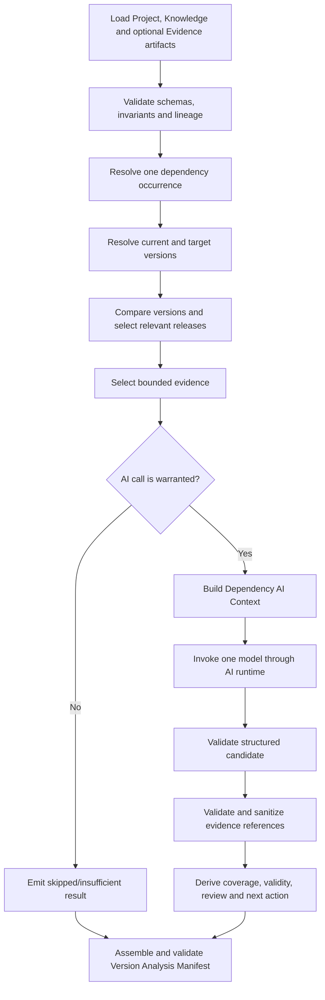

# VA-01A — Version Analysis Architecture Discovery

Tài liệu này đề xuất kiến trúc tối thiểu cho MVP-03 — AI Version Analysis dựa trên source code, schema, tests và tài liệu hiện có của UpgradeLens tại phiên bản `0.2.0`. Đây là tài liệu discovery; không mô tả production code đã tồn tại và không thay đổi runtime behavior.

## 1. Executive Summary

MVP-03 nên là một pipeline tuần tự, một lần phân tích cho một dependency occurrence và một model invocation cho mỗi context đủ điều kiện:

```text
Project Manifest + Knowledge Manifest + evidence artifact (khi có)
                              │
                              ▼
             deterministic input/context preparation
                              │
                              ▼
                 one structured model invocation
                              │
                              ▼
            schema validation + evidence validation
                              │
                              ▼
                   Version Analysis Manifest
```

Các quyết định chính:

1. Project Manifest `2.0.0` tiếp tục là nguồn duy nhất cho project/dependency facts. MVP-03 không scan repository hoặc source code.
2. Knowledge Manifest `1.0.0` tiếp tục là nguồn package/release/provenance facts. Nó không bị sửa tại chỗ.
3. Current version, target version, version direction/delta, evidence selection, lineage và validation đều là deterministic. Model chỉ tóm tắt ý nghĩa của delta, phân loại release-level risk và rút ra findings từ evidence đã chọn.
4. AI core chỉ hiểu một `DependencyAiContext` chung. SemVer, PEP 440 và các scheme tương lai nằm sau một static ecosystem version adapter nhỏ; không có plugin SDK hoặc dynamic loading.
5. Output là Version Analysis Manifest có JSON Schema, gồm deterministic facts, AI claims, evidence references và kết quả trust validation. Invalid model output không được publish trực tiếp.
6. Không dùng multi-agent hoặc agent framework. Một workflow và một structured-output call là đủ cho phạm vi hiện tại.
7. Không dùng vector database. Evidence được lọc deterministic theo package, version interval, role, authority, freshness và giới hạn kích thước.
8. Knowledge Manifest hiện tại **chưa chứa nội dung** changelog, release notes hoặc migration guide. Non-registry sources do [`source-provenance.js`](../src/source-provenance.js) tạo đang là URL `unverified` với `snapshot: null`; registry snapshots chỉ có digest, không có portable content locator. Vì fetching, normalization, provenance và snapshot ownership đều thuộc Knowledge Research, Knowledge Evidence Bundle phải là output companion của **MVP-02.x**, không phải một task của MVP-03. Bundle riêng giữ Knowledge Manifest `1.0.0` backward-compatible. Nếu artifact đó không có, MVP-03 phải trả `insufficientEvidence`, `riskLevel: unknown`, yêu cầu human review và không gọi model.
9. Project Manifest hiện chỉ có `declaredVersion`; không có lockfile/resolved version. Đây là enhancement chứ không phải blocker của MVP-03. MVP đầu tiên hỗ trợ hai mode: `exactBaseline` cho exact pin/explicit current và `declaredConstraint` cho range đã parse được. Mode thứ hai không giả range là installed version, chỉ phân tích target-scoped evidence, để delta `unknown`, không cho risk `low` và luôn yêu cầu human review. Lockfile/resolved artifact có thể bổ sung sau mà không đổi AI core.

Kiến trúc này giữ nguyên MVP-01/MVP-02, tái sử dụng lineage, package identity, occurrence, source và digest đã có, đồng thời tạo extension point nhỏ nhất để thêm ecosystem.

## 2. Current Architecture Findings

### 2.1 MVP-01 — Project Discovery và Project Manifest

Luồng hiện tại:

```text
repository files
    → collectCandidateFiles
    → ecosystem detector
    → dependency parser (Node, requirements.txt)
    → discoverProject
    → Project Manifest 2.0.0
```

Các module chính:

| Module | Trách nhiệm đã xác minh |
| --- | --- |
| [`src/files.js`](../src/files.js) | Scan candidate manifests, bỏ symlink và ignored directories, chuẩn hóa path tương đối POSIX. |
| [`src/detectors.js`](../src/detectors.js) | Detect Node, Python, Java, .NET, Go, Rust, Ruby, PHP, AL; chỉ Node và Python `requirements.txt` tạo dependency inventory đầy đủ. |
| [`src/python-requirements.js`](../src/python-requirements.js) | Parse deterministic requirements, normalize tên gần PEP 503, giữ specifier/direct/editable references. |
| [`src/dependencies.js`](../src/dependencies.js) | Sort dependencies, tính declaration/unique/duplicate counts và warning duplicate. |
| [`src/discovery.js`](../src/discovery.js) | Điều phối discovery, workspace relationship, Git metadata, summary, warnings và Project Manifest. |
| [`schemas/project-manifest.schema.json`](../schemas/project-manifest.schema.json) | Public contract Draft 2020-12, `schemaVersion: 2.0.0`, `additionalProperties: false`. |
| [`src/project-manifest.js`](../src/project-manifest.js) | Runtime invariants cho count, portable path, unique project ID và dependency inventory. |
| [`src/project-manifest-input.js`](../src/project-manifest-input.js) | Đọc đúng một byte sequence, validate schema/invariants và tạo exact-byte SHA-256 lineage. |

MVP-01 tạo các facts có thể tái sử dụng trực tiếp trong MVP-03:

- repository name/root và Project Manifest digest;
- project `id`, `path`, `ecosystem`, languages, manifests;
- package manager name/version khi detector biết;
- mỗi dependency occurrence: declared name, normalized name, declared version/reference, dependency type và manifest path;
- trạng thái parser và warnings;
- quan hệ Node workspace.

Giới hạn quan trọng:

- `declaredVersion` là declaration/constraint, không phải installed version;
- không đọc lockfile và không có `resolvedVersion`;
- Java, .NET, Go, Rust, Ruby, PHP và AL mới chủ yếu được detect; inventory thường `unsupported`;
- không có source usage, import, symbol hoặc API usage.

Các tests xác nhận behavior này gồm [`test/discovery.test.js`](../test/discovery.test.js), [`test/python-requirements.test.js`](../test/python-requirements.test.js) và [`test/schema.test.js`](../test/schema.test.js). Tests kiểm tra polyglot/workspace, duplicate declarations, parser failure không phát partial inventory, ordering deterministic và schema/runtime invariants.

### 2.2 MVP-02 — Research planning, providers và Knowledge Manifest

Luồng production hiện tại:

```text
Project Manifest bytes
    → loadProjectManifestInput
    → createResearchPlan
    → npm/PyPI registry adapters
    → resolveSourceProvenance
    → KnowledgeResearchResult
    → build + validate + atomically write Knowledge Manifest 1.0.0
```

Các module chính:

| Module | Trách nhiệm đã xác minh |
| --- | --- |
| [`src/research-plan.js`](../src/research-plan.js) | Group occurrences thành package identity `npm:<name>`/`pypi:<name>`, phân loại invalid/unsupported, sort và validate plan. |
| [`src/knowledge-cache.js`](../src/knowledge-cache.js) | Private filesystem cache có canonical digest, TTL, atomic write và privacy validation. Không phải downstream artifact. |
| [`src/registry/npm-packument.js`](../src/registry/npm-packument.js) | Validate/normalize npm packument thành identity, metadata, registry latest và lexical release index. |
| [`src/registry/npm-registry-adapter.js`](../src/registry/npm-registry-adapter.js) | npm fetch/cache/error boundary; không phụ thuộc npm/Yarn/pnpm/Bun installer behavior. |
| [`src/registry/pypi-project.js`](../src/registry/pypi-project.js) | Validate/normalize PyPI project JSON, release index, yanked facts, metadata và source candidates. |
| [`src/registry/pypi-registry-adapter.js`](../src/registry/pypi-registry-adapter.js) | PyPI fetch/cache/error boundary độc lập installer. |
| [`src/source-provenance.js`](../src/source-provenance.js) | Canonicalize publisher URLs, classify source roles, build source IDs/trust/conflicts. Không fetch nội dung. |
| [`src/knowledge-research.js`](../src/knowledge-research.js) | Bounded-concurrency orchestration, adapter isolation, provenance, warning/cache/status aggregation. |
| [`schemas/knowledge-manifest.schema.json`](../schemas/knowledge-manifest.schema.json) | Public Knowledge Manifest `1.0.0`: lineage, policy, research, package facts, sources, cache summary, warnings. |
| [`src/knowledge-manifest.js`](../src/knowledge-manifest.js) | Referential integrity, ordering, counts, source/warning relationships và timestamp invariants. |
| [`src/knowledge-manifest-builder.js`](../src/knowledge-manifest-builder.js) | Project internal research result sang public manifest; deterministic `researchId`; schema + runtime validation. |
| [`src/knowledge-manifest-writer.js`](../src/knowledge-manifest-writer.js) | Pretty serialization và atomic publication. |
| [`src/http/bounded-fetch.js`](../src/http/bounded-fetch.js) | Bounded JSON response, timeout, media type, redirect/error sanitation và body cleanup. |
| [`src/http/cli-http-runtime.js`](../src/http/cli-http-runtime.js) | CLI-owned Undici lifecycle, không mutate global dispatcher. |
| [`src/cli.js`](../src/cli.js) | `discover` và `research`; research luôn load default Project Manifest, build/validate rồi write Knowledge Manifest. |

MVP-02 tạo dữ liệu có thể tái sử dụng:

- exact Project Manifest lineage và deterministic `researchId`;
- package ID, ecosystem, registry identity và mọi occurrence;
- registry-designated latest version và selection mechanism;
- release index với opaque version/tag, date, URL, prerelease/yanked/deprecated nullable facts và source IDs;
- package metadata, gồm package-level deprecation message khi registry có;
- source catalog: ID, kind, authority, trust, URL, status, supported roles, provenance, digest/retrieval/freshness khi fetched, conflicts;
- explicit package/source status và structured warnings.

Những dữ liệu còn thiếu cho MVP-03:

1. resolved/current version cho non-exact declarations — hữu ích để tăng precision nhưng không chặn `declaredConstraint` analysis;
2. semantic version normalization/comparison và releases nằm trong interval current → target;
3. target policy/request của analysis;
4. content của release notes, changelog, migration guide và compatibility documentation;
5. locator từ một claim/snippet về exact source snapshot;
6. Knowledge Manifest input loader tương đương `loadProjectManifestInput`; hiện builder có validator nhưng CLI chưa có downstream reader;
7. AI runtime, prompt version, structured analysis schema, evidence validator, eval và analysis telemetry.

Điểm thiếu evidence là thực tế implementation, không chỉ thiếu documentation:

- [`src/source-provenance.js`](../src/source-provenance.js) buộc non-registry source chưa fetch phải `status: unverified`, `snapshot: null`;
- [`src/registry/pypi-project.js`](../src/registry/pypi-project.js) ghi rõ changelog/release-note candidates là internal-only và public metadata không có content field;
- registry normalizers chỉ tạo minimal release index;
- [`docs/MVP-02-Knowledge-Manifest-Generation.md`](MVP-02-Knowledge-Manifest-Generation.md) xác nhận source-content fetching nằm ngoài MVP-02 implementation hiện tại;
- [`docs/MVP-02-Knowledge-Manifest.md`](MVP-02-Knowledge-Manifest.md) và [`docs/MVP-02-Architecture.md`](MVP-02-Architecture.md) xác định Knowledge Store là private và MVP-03 không được consume trực tiếp.

Tests liên quan gồm [`test/research-plan.test.js`](../test/research-plan.test.js), [`test/npm-registry-adapter.test.js`](../test/npm-registry-adapter.test.js), [`test/pypi-registry-adapter.test.js`](../test/pypi-registry-adapter.test.js), [`test/source-provenance.test.js`](../test/source-provenance.test.js), [`test/knowledge-research.test.js`](../test/knowledge-research.test.js), [`test/knowledge-manifest-schema.test.js`](../test/knowledge-manifest-schema.test.js), [`test/knowledge-manifest-generation.test.js`](../test/knowledge-manifest-generation.test.js), cache/HTTP lifecycle tests và fixtures dưới [`test/fixtures/knowledge-manifest`](../test/fixtures/knowledge-manifest).

### 2.3 Boundary hiện tại và coding conventions

Boundary đã được code và docs duy trì nhất quán:

| Stage | Owns | Không owns |
| --- | --- | --- |
| MVP-01 Discovery | Repository scan, project/dependency facts | Registry/network, version meaning, AI |
| MVP-02 Research | Package identity, external facts, provenance, cache, Knowledge Manifest và portable Knowledge Evidence Bundle | Current resolution, version comparison, breaking-change reasoning |
| MVP-03 Version Analysis | Current/target/delta, evidence-grounded release meaning | Source usage/impact, code change, migration plan |
| MVP-04 Impact Analysis | Repository-specific affected usage/components | Automatic patch và detailed migration planning |
| MVP-05 Migration Planning | Ordered migration plan/validation/rollback | Package-manager execution hoặc implicit repository mutation |

Naming/coding patterns nên tiếp tục:

- file name kebab-case; exported functions dạng `create*`, `load*`, `build*`, `validate*`, `serialize*`, `write*`;
- factories trả explicit boundary object (`createKnowledgeCache`, `createNpmRegistryAdapter`, `createKnowledgeResearchOrchestrator`);
- public schema version độc lập package version và internal result/plan version;
- JSON Schema Draft 2020-12 với `additionalProperties: false`, sau đó runtime invariants cho ordering/referential integrity;
- exact-byte digest cho input lineage, canonical JSON digest cho logical identity;
- injected clock/fetch/adapters/filesystem cho deterministic tests;
- partial external failure thành status/warning; invalid top-level input/invariant là fatal;
- arrays sorted code-unit lexically; async completion order không ảnh hưởng artifact;
- adapters/providers là static implementation extension, không phải runtime plugin;
- [`src/index.js`](../src/index.js) chỉ export discovery và research-planning entry points; phần orchestration/manifest/provider hiện vẫn internal.

## 3. MVP-03 Scope

### In scope

- load và cross-validate Project Manifest, Knowledge Manifest và evidence artifact được khai báo;
- resolve một dependency occurrence thành analysis input;
- chọn `exactBaseline` khi có exact declaration/explicit current/future resolved artifact, hoặc `declaredConstraint` khi chỉ có parseable declaration range;
- resolve target từ explicit target hoặc opt-in `registryLatest` policy;
- normalize/compare version bằng ecosystem adapter;
- chọn release/evidence liên quan đến interval current → target;
- tạo một bounded, generic `DependencyAiContext` cho một dependency;
- dùng một AI runtime boundary để sinh structured claims;
- phân tích release-level breaking changes, deprecations và compatibility notes;
- phân loại release-level risk `low | medium | high | unknown`;
- validate JSON Schema và mọi evidence reference;
- tính evidence coverage, result validity và human-review requirement deterministic;
- emit một Version Analysis Manifest machine-readable, reusable bởi CLI/eval/MVP-04.

### Out of scope

- scan source code, manifest hoặc lockfile ngoài versioned input artifacts;
- tìm file, symbol, import hoặc API usage bị ảnh hưởng;
- project-specific impact/severity;
- automatic code edit, patch hoặc dependency upgrade;
- detailed multi-step migration plan, command sequence, rollback plan;
- chạy npm/pip/Maven/NuGet/Cargo/Go;
- vector database, semantic index hoặc general web search;
- multi-agent, agent framework, MCP/server;
- dynamic plugin loading hoặc public plugin SDK;
- vulnerability/supply-chain analysis;
- sửa Project/Knowledge Manifest đã publish.

`migrationComplexity` không nằm trong minimal output. Không có source usage, field này dễ bị hiểu là độ khó migration thực tế của project, thuộc MVP-04/MVP-05. MVP-03 vẫn có thể ghi documented breaking/deprecation/compatibility findings để stage sau đánh giá complexity có căn cứ.

## 4. Proposed Data Flow



### 4.1 Phân loại trách nhiệm

| Bước | Loại | Hành vi lỗi/partial |
| --- | --- | --- |
| Load/parse artifacts | Deterministic trust boundary | Unsupported schema, invalid JSON/invariants hoặc lineage mismatch là fatal; không gọi AI, không replace output cũ. |
| Resolve dependency input | Deterministic | Missing project/package/occurrence match tạo `status: skipped`, reason cụ thể; không gọi AI. Ambiguous match là input error, không chọn ngẫu nhiên. |
| Resolve baseline/target | Ecosystem-specific deterministic | Exact current tạo `exactBaseline`; parseable range tạo `declaredConstraint`; declaration không parse được, invalid target, downgrade không được policy cho phép hoặc exact current = target thì không gọi AI. |
| Compare/select releases | Ecosystem-specific deterministic | Exact mode chọn interval `(current, target]`. Constraint mode không giả lập interval: delta là `unknown` và chỉ giữ evidence gắn trực tiếp target/target line; luôn human review. |
| Select knowledge | Deterministic retrieval | Cho phép stale/partial evidence chỉ khi được gắn warning; conflict hoặc thiếu critical evidence không được biến thành low risk. |
| Build context | Deterministic | Context vượt limit phải trim theo priority; nếu vẫn vượt thì fail package-local, không cắt JSON tùy tiện. |
| Invoke model | AI | Timeout/provider error là package-local `status: failed`; không làm mất kết quả dependency khác. Không tự retry nhiều vòng; tối đa một transport retry do runtime policy. |
| Structured validation | Trust boundary | Invalid JSON/schema: không publish candidate. Một optional format retry có thể cấu hình sau; default MVP là fail package-local. |
| Evidence validation | Trust boundary | Xóa refs ngoài selected set. Claim không còn valid evidence bị loại; risk bị hạ về `unknown`; thêm limitation/review reason. AI không được tự tạo URL/ID. |
| Final assembly | Deterministic | Copy facts từ context, derive coverage/validity/review/action, validate full manifest rồi atomic write. |

### 4.2 Khi nào được gọi AI

Chỉ gọi model khi tất cả điều kiện sau đúng:

- Project/Knowledge/evidence lineage hợp lệ;
- dependency identity resolve duy nhất;
- có target hợp lệ và baseline là exact current **hoặc** parseable declared constraint;
- có ít nhất một evidence item có content, source/digest hợp lệ và liên quan interval;
- không có unresolved authoritative conflict cho cùng claim domain;
- context nằm trong size policy.

Trong `declaredConstraint` mode, “liên quan interval” nghĩa là evidence gắn trực tiếp target hoặc target release line; model không được claim toàn bộ thay đổi từ một installed version chưa biết. Không gọi AI khi declaration không parse được, target không hợp lệ, package `notFound/invalid/unavailable`, exact current bằng target, evidence chỉ gồm URL/digest không có content, hoặc evidence không liên quan target. Kết quả deterministic trong các case này vẫn được emit để CLI/eval phân biệt “không cần model” với “model lỗi”.

### 4.3 Partial data và human review

Có thể tiếp tục với partial data khi current/target/delta chắc chắn và có một tập evidence hợp lệ, nhưng source stale, thiếu một evidence category, hoặc một source phụ unavailable. Kết quả phải có coverage `partial` và review reason.

Human review bắt buộc khi:

- risk là `high` hoặc `unknown`;
- coverage là `none`/`partial`;
- selected evidence stale hoặc có source conflict;
- model candidate bị drop/sanitize claim;
- adapter chỉ phân loại delta là `other`/`unknown`;
- analysis mode là `declaredConstraint` vì installed baseline chưa được xác nhận;
- evidence nói rõ breaking change/deprecation nhưng target applicability không chắc chắn;
- provider/runtime failure hoặc analysis skipped vì baseline unsupported/evidence thiếu.

## 5. Dependency AI Context Contract

`DependencyAiContext` là internal, versioned contract; không nhất thiết publish toàn bộ vào output. Một context tương ứng một dependency occurrence và một target. Baseline có thể là exact version hoặc declared constraint; hai mode không được trộn semantics. Nếu cùng package xuất hiện ở nhiều project/manifest/type/version declarations, mỗi tuple occurrence có context riêng. Các occurrence hoàn toàn trùng nhau có thể dùng chung model result qua deterministic context digest, nhưng final manifest vẫn giữ occurrence refs riêng.

### 5.1 Contract đề xuất

```json
{
  "contextVersion": "1",
  "contextId": "sha256:<canonical-context-digest>",
  "lineage": {
    "projectManifestDigest": "sha256:<digest>",
    "knowledgeManifestDigest": "sha256:<digest>",
    "knowledgeResearchId": "sha256:<digest>",
    "evidenceArtifactDigest": "sha256:<digest-or-omitted>"
  },
  "dependency": {
    "projectId": "node:.",
    "packageId": "npm:example",
    "declaredName": "example",
    "normalizedName": "example",
    "ecosystem": "node",
    "registry": "npm",
    "packageManager": "npm",
    "dependencyType": "dependency",
    "manifest": "package.json"
  },
  "versions": {
    "analysisMode": "exactBaseline",
    "declaredVersion": "^1.0.0",
    "currentVersion": "1.4.2",
    "currentVersionSource": "explicit",
    "targetVersion": "2.0.0",
    "targetPolicy": "explicit",
    "delta": {
      "direction": "upgrade",
      "classification": "major"
    }
  },
  "knowledge": {
    "relevantReleases": ["2.0.0"],
    "evidence": [
      {
        "id": "sha256:<evidence-id>",
        "kind": "releaseNotes",
        "sourceId": "npm:example:releaseNotes:<source-digest>",
        "sourceUrl": "https://example.org/releases/2",
        "authority": "officialProject",
        "trust": "official",
        "retrievedAt": "2026-07-14T00:00:00.000Z",
        "contentDigest": "sha256:<content-digest>",
        "locator": "heading:2.0.0",
        "releaseVersions": ["2.0.0"],
        "content": "bounded normalized excerpt"
      }
    ]
  },
  "metadata": {
    "selectedEvidenceIds": ["sha256:<evidence-id>"],
    "missingInformation": [],
    "warnings": [],
    "size": {
      "characters": 1234,
      "evidenceItems": 1
    }
  }
}
```

### 5.2 Field sources và requirement

| Field group | Field | Required | Source/owner | Lý do |
| --- | --- | --- | --- | --- |
| Identity | `projectId` | Có | Project Manifest + occurrence | Scope dependency theo project. |
| Identity | `packageId` | Có | Knowledge package ID | Stable cross-artifact identity. |
| Identity | `declaredName`, `normalizedName` | Có | Occurrence + Knowledge identity | Giữ spelling và lookup identity tách biệt. |
| Identity | `ecosystem` | Có | Cross-validated Project/Knowledge | Chọn adapter, không cho model suy đoán. |
| Identity | `registry` | Có khi researched | Knowledge identity | Package manager không đồng nghĩa registry. |
| Identity | `packageManager` | Không | Project Manifest project | Contextual fact; không dùng để chọn AI behavior. |
| Identity | `dependencyType`, `manifest` | Có | Occurrence | Phân biệt duplicate declarations và downstream display. |
| Version | `analysisMode` | Có | Baseline resolver enum | `exactBaseline | declaredConstraint`; quyết định độ chính xác và review policy. |
| Version | `declaredVersion` | Có, nullable | Project/Knowledge occurrence | Giữ declaration gốc. |
| Version | `currentVersion` | Có nhưng nullable | Explicit input, exact pin, hoặc future resolved artifact | Bắt buộc non-null trong `exactBaseline`; null trong `declaredConstraint`, không được model điền. |
| Version | `currentVersionSource` | Có nhưng nullable | Resolver enum | `explicit | exactDeclaration | resolvedArtifact`; null trong constraint mode. |
| Version | `targetVersion` | Có để gọi AI | Explicit input hoặc deterministic target policy | Không cho model chọn target. |
| Version | `targetPolicy` | Có | Request/policy enum | `explicit | registryLatest`; default đề xuất là `explicit`. |
| Version | `delta` | Có | Ecosystem adapter | `direction` và `classification` deterministic. |
| Knowledge | `relevantReleases` | Có, có thể rỗng | Adapter + Knowledge release index | Giới hạn evidence theo interval. |
| Knowledge | `evidence[]` | Có, có thể rỗng | Knowledge facts + portable evidence artifact | Chỉ content selected mới vào prompt. |
| Evidence | `id`, `sourceId`, `contentDigest` | Có | Deterministic evidence materialization | Trust validator dùng allowlist IDs. |
| Evidence | `kind` | Có | Research normalization enum | `releaseNotes | breakingChanges | deprecations | migrationGuide | compatibility | changelog | registryFact`. |
| Evidence | URL/ref, timestamp, locator | Có khi source cung cấp | Source catalog/evidence artifact | Audit được exact snapshot/section. |
| Evidence | `content` | Có để model dùng | Bounded evidence artifact | Digest/URL một mình không đủ grounding. |
| Metadata | lineage | Có | Exact artifact bytes | Reproducibility và cache/eval identity. |
| Metadata | missing/warnings | Có, arrays | Resolver/selector | Model thấy rõ uncertainty nhưng không quyết định validity. |
| Metadata | size | Có | Context builder | Observability/budget; character count là baseline đơn giản. Token estimate chỉ thêm khi runtime cung cấp tokenizer. |

Không đưa `generatedAt`, toàn bộ package list, toàn bộ source catalog, cache summary, unrelated occurrences hoặc full release index vào prompt.

### 5.3 Evidence artifact tối thiểu

Knowledge Manifest `1.0.0` không đủ để phục hồi content bằng public contract. Đề xuất nhỏ nhất là một `Knowledge Evidence Bundle 1.0.0` do Knowledge Research sở hữu và được triển khai trong MVP-02.x, không phải trong Version Analysis. Bundle không sửa Knowledge Manifest đã publish, không expose Knowledge Store layout, và có lineage tới Knowledge Manifest digest/research ID cùng các item:

```json
{
  "id": "sha256:<sourceId + contentDigest + locator>",
  "packageId": "npm:example",
  "sourceId": "npm:example:releaseNotes:<digest>",
  "kind": "releaseNotes",
  "contentDigest": "sha256:<normalized-content>",
  "retrievedAt": "2026-07-14T00:00:00.000Z",
  "mediaType": "text/plain",
  "locator": "heading:2.0.0",
  "releaseVersions": ["2.0.0"],
  "content": "bounded normalized evidence"
}
```

Chỉ fetch các changelog/release-notes/migration URLs đã được provenance resolver xác định; không crawl site, search web hoặc follow arbitrary links. Bundle phải có schema, size limits, canonical ordering và digest validation. Đây là focused completion của research evidence boundary đã được [`docs/MVP-02-Architecture.md`](MVP-02-Architecture.md) dự liệu, không phải rewrite MVP-02.

Việc dùng companion artifact thay vì thêm required fields vào Knowledge Manifest có ba hệ quả mong muốn:

- Knowledge Manifest `1.0.0`, readers và fixtures hiện tại không thay đổi; consumer không cần textual evidence vẫn hoạt động như trước;
- Knowledge Research sở hữu trọn vòng đời fetch → normalize → provenance → snapshot → publication, còn MVP-03 chỉ load/select/reason;
- Evidence Bundle có thể được tái sử dụng bởi eval, MVP-04 hoặc tooling khác mà không phụ thuộc prompt/context format của Version Analysis, nhờ đó giảm coupling hai stage.

### 5.4 Context selection policy

Selector deterministic thực hiện theo thứ tự:

1. join đúng `packageId` và occurrence;
2. giữ release facts trong `(current, target]` theo adapter;
3. giữ evidence có `releaseVersions` giao interval; evidence không version-tagged chỉ giữ khi role là migration/compatibility/changelog cho target major/minor tương ứng;
4. ưu tiên `officialProject/official`, sau đó `publisherProvided|registryAuthoritative/publisher`, rồi `verified`; community mặc định loại;
5. loại `notFound`, `unavailable`, digest mismatch và content không có;
6. stale evidence có thể giữ nhưng thêm warning/review; source conflict không được resolve bằng thứ tự ưu tiên một cách im lặng;
7. deduplicate theo content digest; giữ source refs của duplicate nếu cần provenance;
8. cap theo số item và tổng characters bằng policy versioned; trim lowest priority trước;
9. stable sort theo version applicability, kind priority, authority/trust, source ID, locator;
10. tính `contextId` sau selection từ canonical JSON.

Không cần embeddings/vector DB cho exact package + bounded version interval. Chỉ xem xét semantic retrieval khi evidence thực tế chứng minh deterministic filtering không đủ.

## 6. AI Version Analysis Output Contract

### 6.1 Top-level Version Analysis Manifest

Default artifact đề xuất: `.upgradelens/version-analysis-manifest.json`.

```json
{
  "schemaVersion": "1.0.0",
  "generatedAt": "2026-07-14T00:00:00.000Z",
  "generator": { "name": "UpgradeLens", "version": "<package version>" },
  "input": {
    "projectManifest": { "schemaVersion": "2.0.0", "artifact": "...", "artifactDigest": "..." },
    "knowledgeManifest": { "schemaVersion": "1.0.0", "artifact": "...", "artifactDigest": "...", "researchId": "..." },
    "evidenceArtifact": { "schemaVersion": "1.0.0", "artifact": "...", "artifactDigest": "..." }
  },
  "analysis": {
    "promptVersion": "1",
    "contextVersion": "1",
    "resultCount": 1
  },
  "results": []
}
```

`runId` là operational correlation ID, khác deterministic `contextId` và `researchId`, và chỉ nằm trong telemetry. Model/provider/token/latency cũng không cần nằm trong portable result để tránh vendor coupling. Có thể ghi provider/model ở optional execution metadata sau khi privacy/reproducibility policy được chốt, nhưng không dùng làm semantic identity.

### 6.2 Một result tối thiểu

```json
{
  "id": "sha256:<lineage + occurrence + current + target>",
  "status": "analyzed",
  "contextId": "sha256:<context-digest>",
  "dependency": {
    "projectId": "node:.",
    "packageId": "npm:example",
    "declaredName": "example",
    "normalizedName": "example",
    "ecosystem": "node",
    "registry": "npm",
    "dependencyType": "dependency",
    "manifest": "package.json"
  },
  "versions": {
    "analysisMode": "exactBaseline",
    "declaredVersion": "^1.0.0",
    "currentVersion": "1.4.2",
    "currentVersionSource": "explicit",
    "targetVersion": "2.0.0",
    "targetPolicy": "explicit",
    "delta": { "direction": "upgrade", "classification": "major" }
  },
  "summary": "Concise evidence-grounded meaning of this upgrade.",
  "summaryEvidenceRefs": ["sha256:<evidence-id>"],
  "riskLevel": "high",
  "riskEvidenceRefs": ["sha256:<evidence-id>"],
  "findings": [
    {
      "id": "finding-1",
      "kind": "breakingChange",
      "summary": "A documented behavior changed.",
      "appliesToVersions": ["2.0.0"],
      "evidenceRefs": ["sha256:<evidence-id>"]
    }
  ],
  "evidenceCoverage": "sufficient",
  "validation": {
    "status": "valid",
    "warningCodes": []
  },
  "requiresHumanReview": true,
  "humanReviewReasons": ["HIGH_RISK"],
  "nextAction": "reviewBeforeImpactAnalysis",
  "limitations": []
}
```

### 6.3 Field ownership

| Field | Owner | Enum/evidence | Quy tắc |
| --- | --- | --- | --- |
| `id`, `status`, `contextId` | Deterministic assembler | status enum | `analyzed | skipped | failed`; không do model sinh. |
| `dependency`, `versions` | Deterministic context | enums cho mode/source/policy/delta | Copy verbatim; model output schema không chứa các field này. Constraint mode giữ `currentVersion: null` và delta `unknown`. |
| `summary` | AI | refs bắt buộc khi analyzed | Không được nói source-code impact. |
| `riskLevel` | AI candidate, trust validator có quyền hạ về unknown | `low | medium | high | unknown`; refs bắt buộc nếu khác unknown | Là release-level risk, không phải project impact. |
| `findings` | AI | kind enum; refs bắt buộc | Một array chung giúp schema/eval đơn giản; CLI group theo kind. |
| `evidenceCoverage` | Deterministic trust validator | `none | partial | sufficient` | Coverage không phải truth/confidence. |
| `validation` | Deterministic trust validator | `valid | validWithWarnings` | Invalid candidate không được publish như valid result. |
| `requiresHumanReview`, reasons | Deterministic policy | boolean + reason-code enums | Không để model tự miễn review. |
| `nextAction` | Deterministic policy | `collectEvidence | resolveCurrentVersion | reviewBeforeImpactAnalysis | proceedToImpactAnalysis | noUpgradeNeeded | retryAnalysis` | Tránh free-text migration recommendation. |
| `limitations` | Deterministic builder/validator | structured code + message | Từ missing info, stale/conflict, dropped claims, runtime errors. |

Finding kinds tối thiểu: `breakingChange`, `deprecation`, `compatibility`. Migration guide là evidence kind, không phải một loại kết luận riêng. Nếu một guide chứa required action, finding phù hợp vẫn là breaking/compatibility/deprecation; detailed step planning để MVP-05.

Candidate schema gửi cho model chỉ gồm `summary`, `summaryEvidenceRefs`, `riskLevel`, `riskEvidenceRefs` và `findings`. Final assembler thêm mọi field còn lại. Trong `declaredConstraint` mode, trust policy không cho final risk là `low`; output phải có `VERSION_UNCERTAIN`, `requiresHumanReview: true`, và findings chỉ được claim target-scoped behavior. Với `status: skipped | failed`, result vẫn giữ deterministic dependency/version facts đã resolve được, nhưng claims/findings rỗng, risk `unknown`, coverage `none`, review `true` và limitation/error code cụ thể.

`humanReviewReasons` dùng tập enum nhỏ: `HIGH_RISK`, `UNKNOWN_RISK`, `EVIDENCE_NONE`, `EVIDENCE_PARTIAL`, `SOURCE_STALE`, `SOURCE_CONFLICT`, `VERSION_UNCERTAIN`, `CLAIMS_DROPPED`, `ANALYSIS_FAILED`. Nhiều reason được sort/deduplicate deterministic.

### 6.4 Các field không chọn

- `migrationComplexity`: bỏ khỏi MVP-03 minimal contract vì thiếu source usage và project constraints.
- numeric `confidence`: bỏ vì model self-score không calibrated và khó so sánh provider/model. Nếu runtime trả model confidence, chỉ trace như diagnostic. Trust gate dùng evidence coverage + validation + review policy.
- free-text `recommendedNextAction`: thay bằng deterministic enum `nextAction`.
- top-level duplicate arrays `breakingChanges`, `deprecations`, `compatibilityNotes`: thay bằng một `findings[]` có `kind` để giảm schema và validation branches.
- AI-generated URL/source title/version facts: không cho phép; lấy từ context/evidence catalog.

## 7. Evidence and Trust Rules

### 7.1 Claim rules

1. `summary`, non-`unknown` risk và mọi finding là material AI claims, phải có ít nhất một `evidenceRef` trong selected context.
2. Evidence ref chỉ được trỏ tới `knowledge.evidence[].id` đã allowlist. Model không được tạo URL, source ID, digest hoặc evidence ID.
3. Ref hợp lệ về ID nhưng evidence digest/lineage không hợp lệ vẫn bị reject.
4. Deterministic facts không được hỏi lại model và không được merge từ model response.
5. Một registry release fact chứng minh version/date/yanked/deprecated fact mà nó support; nó không tự chứng minh breaking change.
6. Absence of evidence không phải evidence of absence. Không có breaking-change content không đủ để kết luận risk `low`.
7. Source conflict phải được giữ visible. Validator không chọn source thắng chỉ vì array order.
8. Invalid refs bị loại. Claim chỉ còn invalid refs bị drop; summary không còn support được thay bằng deterministic insufficient-evidence summary; risk thành `unknown`; result `validWithWarnings` và human review.
9. Raw invalid model candidate được lưu tối đa trong ephemeral debug telemetry theo redaction policy, không vào public manifest.

### 7.2 Risk rubric tối thiểu

| Risk | Ý nghĩa release-level | Điều kiện evidence |
| --- | --- | --- |
| `low` | Relevant evidence đủ, không nêu breaking/deprecation/compatibility action cho interval và delta nhỏ theo adapter. | Coverage `sufficient`; absence phải dựa trên bộ evidence category được policy coi là đủ, không chỉ một release list. |
| `medium` | Có documented deprecation, opt-in behavior change hoặc compatibility/manual adjustment nhưng chưa có supported hard break. | Valid refs cho các findings/risk. |
| `high` | Có documented breaking change, incompatible requirement hoặc mandatory migration action trong interval. | Valid authoritative/publisher evidence refs; luôn human review. |
| `unknown` | Thiếu/mâu thuẫn/stale critical evidence, version applicability không chắc hoặc validation đã loại material claims. | Không cần fake refs; luôn human review. |

### 7.3 Bốn khái niệm không được trộn

| Khái niệm | Nguồn | Ý nghĩa | Có quyết định publish/review? |
| --- | --- | --- | --- |
| Model confidence | Provider/model self-assessment | Cảm nhận của model, chưa calibrated | Không. Trace-only nếu có. |
| Evidence coverage | Deterministic validator | Material claims có valid refs và required evidence categories có mặt tới mức nào | Có. `none/partial` bắt buộc review. |
| Result validity | Schema + invariant + evidence validator | Output có đúng shape, refs và trust rules không | Có. Invalid candidate không publish; repaired result là `validWithWarnings`. |
| Human-review requirement | Deterministic policy | Con người có phải xác nhận trước stage tiếp theo không | Có. Derived từ risk, coverage, conflict, stale, validation và error states. |

Không cần composite trust score. Các enum và reason codes riêng dễ audit hơn một số tổng hợp khó giải thích.

## 8. Ecosystem Extension Points

AI workflow không biết npm, React, Ant Design, PyPI hoặc framework name. Nó nhận context chung sau khi version adapter đã hoàn thành facts.

Interface tối thiểu đề xuất:

```ts
interface EcosystemVersionAdapter {
  ecosystem: string;
  registries: readonly string[];

  normalizeVersion(value: string):
    | { ok: true; value: string }
    | { ok: false; reason: string };

  resolveDeclaredBaseline(declaredVersion: string | null):
    | { kind: "exactVersion"; version: string }
    | { kind: "declaredConstraint"; constraint: string }
    | { kind: "unsupported"; reason: string };

  targetSatisfiesDeclaration(
    declaredVersion: string,
    target: string
  ): "yes" | "no" | "unknown";

  compareVersions(current: string, target: string): {
    direction: "upgrade" | "same" | "downgrade" | "unknown";
    classification: "major" | "minor" | "patch" | "prerelease" | "other" | "unknown";
  };

  selectRelevantReleases(
    releases: readonly KnowledgeRelease[],
    input: {
      mode: "exactBaseline" | "declaredConstraint";
      current: string | null;
      target: string;
    }
  ): readonly KnowledgeRelease[];
}
```

Target policy resolver có thể là common deterministic component gọi adapter để validate/compare target. Package identity và registry metadata vẫn thuộc discovery/research adapters hiện có; không copy các rule đó vào AI core.

Static registry ban đầu:

```text
node   → npm-compatible SemVer adapter
python → PEP 440 adapter
```

`declaredConstraint` là common mode, còn syntax do adapter sở hữu: npm/Cargo dùng SemVer-style ranges, Python dùng PEP 440 specifiers, Maven/NuGet có range riêng, và Go thường cung cấp selected module version hoặc pseudo-version trong `go.mod`. Vì core giữ declaration opaque ngoài adapter và cho phép current nullable, lockfile support có thể thêm theo ecosystem mà không đổi prompt/output claim model.

Khi thêm ecosystem:

| Ecosystem | Logic chỉ nằm ở boundary | Common AI core nhận |
| --- | --- | --- |
| Maven/Gradle | Maven coordinates, comparable-version policy, repository mapping, release selection | normalized identity, current/target/delta, evidence |
| NuGet | package ID normalization, NuGet version rules, registry target facts | cùng common context |
| Cargo | crate identity, Cargo SemVer/range resolution, crates.io metadata | cùng common context |
| Go Modules | module path/version/pseudo-version rules, proxy metadata | cùng common context |
| Python | PEP 503 identity đã có ở research; PEP 440 exact/range/ordering ở version adapter | cùng common context |
| npm | npm identity đã có ở research; SemVer/tags/ranges ở version adapter | cùng common context |

Contributor thêm ecosystem cần:

1. Project Manifest dependency inventory support (nếu chưa có);
2. Knowledge Research registry/provider mapping và fixtures;
3. một `EcosystemVersionAdapter` + conformance tests;
4. không sửa context builder, AI runtime, output schema hoặc trust validator nếu common fields đủ.

Không tạo dynamic loader, package hooks, arbitrary third-party code execution hoặc namespaced plugin manifest trong MVP-03.

## 9. Evaluation Strategy

### 9.1 Dataset format

Một thư mục fixtures nhỏ, không cần eval framework riêng:

```text
test/fixtures/version-analysis/<case>/
  project-manifest.json
  knowledge-manifest.json
  evidence-bundle.json
  request.json
  expected.json
```

`expected.json` không assert exact prose. Nó chứa machine-checkable expectations:

```json
{
  "expectedModelInvocation": true,
  "expectedStatus": "analyzed",
  "expectedAnalysisMode": "exactBaseline",
  "expectedDelta": "major",
  "allowedRiskLevels": ["high"],
  "requiredFindingKinds": ["breakingChange"],
  "minimumEvidenceCoverage": "sufficient",
  "requiresHumanReview": true,
  "forbiddenUnsupportedClaims": ["source-code impact"]
}
```

Model response fixtures có thể được injected vào `AiRuntime` để unit tests không gọi external service. Một optional manual/live eval sau này dùng cùng cases nhưng không nằm trong default CI.

### 9.2 Golden samples ban đầu

| Case | Expected focus |
| --- | --- |
| npm major upgrade | Major delta, breaking evidence, high risk, valid refs, review true. |
| npm minor/patch | Deterministic minor/patch; chỉ low khi evidence set đủ; không suy từ delta một mình. |
| Python upgrade | PEP 440 normalization/range; compatibility/deprecation evidence; common context/output không đổi. |
| Missing knowledge/content | Không gọi model; `skipped`, risk unknown, coverage none, `collectEvidence`, review true. |
| Conflicting evidence | Không silently choose source; risk unknown hoặc supported high theo non-conflicting evidence, coverage partial, review true. |

Nên thêm hai deterministic edge fixtures sớm: (1) declared range không có current fact nhưng có target-scoped evidence vẫn gọi model ở `declaredConstraint`, delta unknown, không cho low risk và review true; (2) exact current = target không gọi model.

### 9.3 Metrics tối thiểu

| Metric | Cách tính |
| --- | --- |
| Structured output validity | Tỷ lệ raw model candidates pass candidate JSON Schema. |
| Evidence reference validity | Valid selected refs / all emitted refs; final published result phải đạt 100%. |
| Evidence coverage | Material claims có ≥1 valid ref / material claims, cộng required-category check. |
| Unsupported claim rate | Human-annotated claims không entailed bởi cited evidence / material claims. Không tự động hóa bằng model trong MVP. |
| Risk classification agreement | Result risk thuộc `allowedRiskLevels` của golden case. |
| Human-review correctness | Boolean/reasons match expected policy cases. |
| Context repeatability | Canonical context bytes/context ID giống nhau cho cùng artifacts/request/policy bất kể array/completion order hợp lệ. |
| No-call correctness | Missing/invalid/no-op cases không invoke runtime. |

Không dùng exact summary string hoặc single aggregate score. Báo từng metric giúp thấy lỗi nằm ở model, context, evidence hay trust validator.

## 10. Observability Boundary

AI runtime boundary tối thiểu:

```ts
interface AiRuntime {
  generateStructured(request: {
    runId: string;
    contextId: string;
    promptVersion: string;
    context: DependencyAiContext;
    outputSchema: object;
  }): Promise<{
    output: unknown;
    provider: string;
    model: string;
    latencyMs: number;
    usage?: { inputTokens?: number; outputTokens?: number };
  }>;
}

interface AnalysisTelemetry {
  record(event: AnalysisTelemetryEvent): void | Promise<void>;
}
```

Workflow chỉ phụ thuộc interface và no-op implementation mặc định. Adapter cho OpenTelemetry/Langfuse hoặc provider SDK có thể thêm sau; core không import vendor.

Metadata trace tối thiểu:

- run ID, deterministic context ID;
- project ID, package/dependency ID, ecosystem, registry;
- analysis mode, baseline source, nullable normalized current, target và delta classification;
- provider/model;
- prompt/context/schema version;
- context characters, selected evidence count và optional token estimate;
- latency và token usage khi provider trả;
- model invocation outcome;
- candidate schema validation status;
- evidence validation status/coverage;
- final status/risk/review boolean;
- stable error category, không phải raw stack/body.

Event names có thể chỉ cần `analysis.started`, `model.completed`, `validation.completed`, `analysis.completed|failed`. Không log full prompt/evidence mặc định vì có thể lớn hoặc nhạy cảm; log digests/IDs. Debug content capture phải opt-in, redacted và không nằm trong portable manifest.

Error categories tối thiểu: `INPUT_INVALID`, `LINEAGE_MISMATCH`, `BASELINE_UNSUPPORTED`, `TARGET_INVALID`, `VERSION_UNSUPPORTED`, `EVIDENCE_MISSING`, `EVIDENCE_CONFLICT`, `CONTEXT_LIMIT`, `MODEL_TIMEOUT`, `MODEL_PROVIDER_ERROR`, `OUTPUT_SCHEMA_INVALID`, `EVIDENCE_REFERENCE_INVALID`, `ARTIFACT_WRITE_FAILED`.

## 11. Recommended Implementation Plan

Evidence completion là prerequisite do MVP-02.x sở hữu, sau đó MVP-03 còn ba task. Việc tách roadmap phản ánh artifact ownership; nó không tạo runtime coupling ngược từ Research sang AI.

### MVP-02-09 — Portable Knowledge Evidence Completion (prerequisite)

**Phạm vi:** Hoàn thiện Knowledge Research bằng một versioned Knowledge Evidence Bundle liên kết Knowledge Manifest/source IDs. Fetch có giới hạn chỉ cho explicit changelog/release-notes/migration/compatibility candidates; normalize bounded text, locator, digest, version applicability; không crawl/search/vector DB và không chứa AI-specific prompt fields.

**Dependency:** MVP-02 `0.2.0`, source provenance và Knowledge Manifest `1.0.0`.

**Acceptance criteria:** Bundle có schema/invariants/lineage/atomic writer; không expose cache path/secrets; every item resolves package/source/digest; missing content tạo explicit status/warning; Knowledge Manifest `1.0.0`, existing readers/fixtures/runtime không đổi.

**Test strategy:** Recorded HTTP/content fixtures; size/media/redirect/privacy limits; digest mismatch; stale/conflict/missing; canonical ordering; offline behavior; no live service in CI.

**Đầu ra:** Evidence bundle schema, reader/writer, bounded source-content adapter(s), fixtures và Knowledge Research contract documentation. Đây là companion output reusable, không phải Version Analysis implementation.

### VA-02 — Deterministic Version Baseline and Context

**Phạm vi:** Load/validate exact-byte Knowledge Manifest và evidence bundle; cross-check lineage; resolve occurrence/baseline/target; implement static Node SemVer và Python PEP 440 adapters; select releases/evidence; build canonical `DependencyAiContext`. Hỗ trợ `exactBaseline` và `declaredConstraint` từ đầu; không parse lockfile.

**Dependency:** MVP-02-09.

**Acceptance criteria:** Range không bị giả thành installed version; exact/explicit current và target có provenance; constraint mode giữ current null/delta unknown, chỉ chọn target-scoped evidence và bắt buộc review; identical inputs tạo identical context bytes/ID; AI core không import ecosystem modules; no-call decision deterministic.

**Test strategy:** Table-driven exact/range/direction/classification tests; fixtures cho duplicate occurrences, declared-constraint advisory, unsupported declaration, same/downgrade, prerelease/yanked, interval/target selection, size trimming và lineage mismatch.

**Đầu ra:** Internal context contract/version, input resolvers, ecosystem version adapter interface/registry và deterministic selector/builder.

### VA-03 — Structured AI Analysis and Trust Validation

**Phạm vi:** Vendor-neutral `AiRuntime`, prompt v1, candidate schema, Version Analysis Manifest schema/builder/writer, evidence validator, human-review/next-action policy và minimal `analyze` CLI/API.

**Dependency:** VA-02.

**Acceptance criteria:** Một dependency context → tối đa một model call; deterministic facts không nằm trong candidate schema; invalid refs không xuất hiện trong final manifest; insufficient evidence không gọi model; constraint mode không emit low risk hoặc exact-delta claims; full artifact schema/invariants pass trước atomic write; partial package failure được biểu diễn rõ.

**Test strategy:** Fake runtime cho valid/invalid JSON, invented refs, unsupported/exact-delta claims trong constraint mode, timeout/provider errors; schema/invariant mutation tests; CLI stdout/custom/default output; no replacement on fatal validation.

**Đầu ra:** `.upgradelens/version-analysis-manifest.json`, runtime/trust boundaries, CLI/API và regression tests.

### VA-04 — Evaluation and Observability Hardening

**Phạm vi:** Thêm năm golden cases, constraint-mode edge cases, metric runner nhỏ và no-op telemetry boundary với optional adapter đầu tiên nếu thật sự cần; chốt prompt/context versions và baseline results.

**Dependency:** VA-03.

**Acceptance criteria:** Metrics trong mục 9 chạy offline; context repeatability/no-call checks ở CI; exact/constraint policy được eval riêng; trace metadata/error categories đủ; không log raw prompt mặc định; không khóa vendor.

**Test strategy:** Golden fixture runner, deterministic fake-model replay, telemetry event snapshot/redaction tests và một opt-in live smoke test ngoài CI.

**Đầu ra:** Dataset/runner/report format, baseline, telemetry interface/events và operational documentation.

## 12. Architecture Decisions

| Quyết định | Lý do | Phương án bị loại |
| --- | --- | --- |
| Không đọc source code trong MVP-03 | MVP-03 phân tích release meaning; code usage/impact thuộc MVP-04. Project Manifest là repository snapshot duy nhất và hiện không có usage inventory. | Scan imports/files trong analysis, đọc repository ad hoc. |
| Không dùng multi-agent | Một dependency có một bounded context, một reasoning task và một structured result; nhiều agent tăng latency, cost và khó evidence attribution. | Planner/researcher/reviewer agents, agent framework. |
| Structured output là bắt buộc | JSON Schema, CLI, eval, manifest persistence, evidence validation và MVP-04 reuse cần stable machine contract. | Free-form Markdown rồi parse heuristically. |
| Deterministic facts nằm ngoài AI | Current/target/delta/identity/lineage có thuật toán hoặc artifact source; để model suy đoán sẽ tạo hallucination và giảm repeatability. | Prompt model tự parse range/chọn target/copy facts. |
| AI core độc lập ecosystem | Version syntax/registry identity khác nhau nhưng reasoning trên selected evidence có cùng shape; contributor chỉ cần adapter nhỏ. | `if npm/react/...` trong prompt/workflow core. |
| Một dependency occurrence = một context | Declared version, project và dependency type có thể khác dù package ID giống nhau; context nhỏ và traceable hơn. | Một prompt cho toàn repository hoặc full package manifest. |
| Một workflow và một model call/context | Đủ cho scope; trust validation deterministic sau model. | Iterative agent loop hoặc multiple model judges mặc định. |
| Không vector database | Package ID + exact version interval + source roles tạo deterministic retrieval nhỏ; repo chưa có semantic corpus/DB runtime. | Embedding/index infrastructure trước khi có evidence volume. |
| Evidence Bundle thuộc MVP-02.x | Fetching, normalization, source provenance và snapshots là Knowledge Research responsibilities. Companion bundle giảm coupling, reusable và giữ Knowledge Manifest `1.0.0` backward-compatible. | Xây bundle trong VA task, MVP-03 đọc cache path/refetch web, hoặc thêm required content vào Knowledge Manifest 1.0.0. |
| Resolved current version không chặn MVP-03 | Exact pins/explicit current cho full interval analysis; parseable declared constraints vẫn cho target-scoped advisory có giới hạn rõ. Lockfile support tăng precision nhưng không tạo capability cốt lõi. | Chờ lockfile parser cho mọi ecosystem hoặc để model đoán installed version từ range. |
| Không sửa Project/Knowledge Manifest đã publish | Artifact ownership/immutability đã là invariant của MVP-02; missing facts phải được tạo ở artifact/version mới. | Enrich manifest in place hoặc repair downstream. |
| Chưa xây plugin SDK hoàn chỉnh | Static adapters là extension point đủ, phù hợp packaging/security hiện tại. | Dynamic loading, marketplace, arbitrary third-party adapters. |
| Chỉ một tài liệu discovery | Data flow, contracts, trust, eval và plan phụ thuộc nhau; một source of truth giảm drift trước implementation. | Tách ba tài liệu context/output/runtime có thể mâu thuẫn. |
| Bỏ migration complexity và numeric confidence | Không có project usage để đo complexity; model confidence chưa calibrated. Evidence coverage/validity/review dễ kiểm chứng hơn. | Persist subjective numeric scores. |
| Explicit target là default; registry latest là opt-in | Knowledge `latest` là registry fact, không phải recommendation. | Tự động coi latest là target cho mọi dependency. |

## 13. Risks and Open Questions

### Risks

- Evidence URL do publisher cung cấp có thể stale/sai/malicious; MVP-02-09 phải giữ URL safety, bounded fetch và trust semantics hiện có.
- Changelog monorepo có thể không map package version một-một; applicability cần explicit locator/version mapping hoặc review, không heuristic im lặng.
- Mutable documentation làm cùng URL đổi nội dung; digest + retrieved timestamp + retained evidence content là bắt buộc cho audit.
- Complete release index và evidence bundle có thể lớn; size policy phải versioned và đo bằng fixtures trước khi thêm index/DB.
- Risk `low` dễ bị hiểu sai nếu evidence corpus không đủ; validator chỉ cho low khi coverage policy đạt `sufficient`.
- Model output vẫn có thể diễn giải quá mức dù citation hợp lệ; unsupported claim rate cần human-annotated eval, không chỉ reference validity.
- Ecosystem version schemes không luôn map major/minor/patch; adapter phải trả `other/unknown` thay vì ép về SemVer.
- Constraint-mode analysis có thể bị đọc nhầm là installed-version analysis; mode, nullable current, unknown delta, review reason và CLI rendering phải luôn visible.

### Open questions thực sự chưa kết luận được từ repository

1. **Nguồn current version dài hạn:** MVP-01 hiện không đọc lockfiles, nhưng đây không còn là blocker. MVP-03 bắt đầu bằng `exactBaseline` và `declaredConstraint`. Sau khi có nhu cầu precision/batch thực tế, cần quyết định nâng Project Manifest bằng resolved dependency artifact hay nhận một analysis request artifact riêng; không nên tự scan lockfile trong MVP-03.
2. **Provider/model đầu tiên:** repository chưa có AI SDK, credential/config convention hoặc deployment target. Runtime boundary đã đủ để implementation bắt đầu, nhưng lựa chọn provider/model cần yêu cầu vận hành/cost/privacy ngoài source hiện tại.
3. **Evidence extraction policy cho complex docs:** explicit heading/version sections là default. Cần fixtures thực tế để chốt liệu một số projects cần bounded whole-document fallback hay repository-release API; không nên generalize trước dữ liệu.
4. **CLI shape cho batch target requests:** source hiện không có config/manifest cho target per dependency. Library contract nên làm trước; sau đó chọn giữa repeated CLI flags và một versioned request file dựa trên expected usage, không nhét target recommendation vào Knowledge Manifest.
5. **Risk rubric ownership:** các enum/rules ở trên đủ để implement, nhưng golden labels cần một maintainer/domain reviewer phê duyệt trước khi xem risk agreement là release gate.

Các câu hỏi này không chặn VA-02/VA-03. Thiếu evidence content vẫn dẫn đến no-call. Thiếu exact current nhưng còn parseable declared constraint cho phép target-scoped advisory với current null, delta unknown và human review; declaration không parse được mới dẫn đến no-call. Trong mọi trường hợp AI không được suy đoán installed version.
